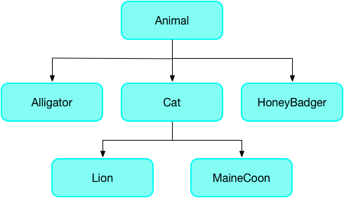

원문 : [https://dart.dev/language/type-system](https://dart.dev/language/type-system)

Dart 언어는 타입안전형입니다.
때때로 사운드 타이핑이라고 하는 변수의 값이 변수의 정적 타입과 일치하는지 확신하기 위해 정적 타입 확인과 [런타임 확인](type-system.md#runtime-checks)을 조합하여 사용합니다.
타입은 필수사항이지만 [타입 추론](type-system.md#type-inference)으로 인해 타입 표기는 생략할 수 있습니다.

정적 타입 확인의 한가지 이점은 Dart의 [정적 분석기](https://dart.dev/guides/language/analysis-options)를 사용하여 컴파일타임에 버그를 찾을 수 있는 능력입니다.

대부분의 정적 분석 에러를 제너릭 클래스의 타입 어노테이션을 추가해서 해결할 수 있습니다.
대부분 일반적인 제너릭 클래스는 콜렉션 타입 (`List<T>`, `Map<K,B>`)입니다.

예로 들어, 아래 코드에서 `printInts()` 함수는 정수 목록을 출력하고 `main()`에서 목록을 생성하고 이것을 `printInts()`에 전달합니다.

```dart
// 정적 분석 : 에러/경고
void printInts(List<int> a) => print(a);

void main() {
  final list = [];
  list.add(1);
  list.add('2');
  printInts(list);
}
```

이전 코드의 결과는 `printInts(list`)를 호출할 때 `list`에서 타입 오류가 발생하는 것 입니다.

```
error - The argument type 'List<dynamic>' can't be assigned to the parameter type 'List<int>'. - argument_type_not_assignable
```

에러는 `List<dynamic>`에서 `List<int>`로 명시적 변환이 불가함을 강조합니다.
`list` 변수는 정적 타입 `List<dynamic>`을 가지게 됩니다.
이것은 `var list = []`로 선언을 하고 분석기에 `dynamic` 보다 더 정확한 타입 인자 추론이 가능하도록 충분한 정보를 제공하지 않았기 때문입니다.
`printInts()` 함수는 매개변수의 타입을 `List<int>`로 예상하고 있기 때문에 타입 불일치의 문제가 됩니다.

아래와 같이 리스트를 생성할 때 타입 어노테이션 (`<int>`)를 추가하면 분석기가 정수 매개변수에 문자열 인자가 할당되지 못하도록 감지합니다.
코드에서 `list.add('2')`에서 따옴표를 삭제하면 정적 분석을 통과하고 에러나 경고없이 실행됩니다.

```dart
void printInts(List<int> a) => print(a);

void main() {
  final list = <int>[];
  list.add(1);
  list.add(2);
  printInts(list);
}
```

[DartPad에서 해보세요.](https://dartpad.dev/25074a51a00c71b4b000f33b688dedd0)

## 건전성이란? {#what-is-soundness}

_건전성_은 프로그램이 특정 유효하지 않는 상태가 되지 않도록 보장하는 것 입니다.
건전 타입 시스템은 표현식에서 값을 계산한 것과 표현식의 정적 타입간 불일치가 있는 상태를 가져올 수 없다는걸 의미합니다.
예로 들어, 표현식의 정적 타입이 `String`이면 런타임동안 계산할 때 문자열만 얻을 수 있다는 것을 보장합니다.

Dart의 타입 시스템은 자바와 C#과 같이 건전합니다.
정적 확인(컴파일타임 에러)와 런타인 확인의 조합을 사용하여 건전성을 강제하도록 합니다.
예로 들어, `String`이 `int`에 할당되면 컴파일타임 에러가 발생합니다.
객체를 `as String`를 사용하여 `String`으로 캐스팅할 때 객체가 `String`이 아닌 경우 런타임 오류가 발생합니다.

## 건전성의 장점 {#the-benefits-of-soundness}

건전 타입 시스템은 다양한 장점을 가지고 있습니다.

* 컴파일타임에 타입에 관련된 버그를 발견
  건전 타입 시스템은 해당 타입에 대하여 모호하지 않도록 코드를 강제하기 때문에 런타임에 찾기 어려울 수 있는 타입관련 버그가 컴파일타임에 드러납니다.

* 좀더 읽기쉬운 코드
  코드가 특정 타입을 가지는 실제 값에 의존해서 읽기 때문에 쉬워집니다.
  건전 Dart에서는 타입은 거짓말을 하지 않습니다.

* 좀더 유지보수가 쉬운 코드
  건전 타입 시스템에서는 코드의 일부분을 변경할때 타입 시스템이 다른 부분에서 문제가 있으면 경고를 해줍니다.

* 더 나은 AOT(ahead of time) 컴파일
  타입이 없어도 AOT 컴파일이 가능하지만 생성된 코드가 덜 효율적입니다.

## 정적 분석을 통과하는 팁 {#tips-for-passing-static-analysis}

정적 타입을 위한 대부분 규칙은 이해하기 쉽습니다.
몇가지 덜 분명한 규칙을 소개합니다.

* 메소드를 오버라이딩할 때 건전 반환 타입 사용하기
* 메소드를 오버라이딩할 때 건전 매개변수 타입 사용하기
* 타입지정 리스트에 다이나믹 리스트를 사용하지않기

다음의 타입 계층을 사용하고 있는 예제를 통해 이 규칙에 대하여 상세히 알아보자.



### 메소드를 오버라이딩할 때 건전 반환 타입 사용하기 {#use-sound-return-types-when-overriding-methods}

하위클래스의 메소드 반환 타입은 상위 클래스의 반환 타입과 동일하거나 하위타입이어야 합니다.
`Animal` 클래스의 getter 메소드를 고려해보겠습니다.

```dart
class Animal {
    void chase(Animal a) { ... }
    Animal get parent => ...
}
```

`parent` getter는 `Animal`을 반환합니다.
`HoneyBadger` 하위 클래스에서 getter의 반환 타입을 `HoneyBadger`(또는 `Animal`의 하위 타입)으로 대체할 수 있으며 그밖에 관계없는 타입은 불가합니다.

```dart
// 정적 분석 : 성공
class HoneyBadger extends Animal {
    @override
    void chase(Animal a) { ... }

    @override
    HoneyBadger get parent => ...
}
```

```dart
// 정적 분석 : 에러/경고
class HoneyBadger extends Animal {
    @override
    void chase(Animal a) { ... }

    @override
    Root get parent => ...
}
```

### 메소드를 오버라이딩할 때 건전 매개변수 타입 사용하기 {#use-sound-parameter-types-when-overriding-methods}

오버라이딩된 메소드의 매개변수는 상위클래스에 대응되는 매개변수와 동일하거나 상위 타입이어야 합니다.
원래 매개변수의 하위타입으로 타입을 변경하여 범위를 축소시킬수 없습니다.

:::note
하위 타입을 사용할 합당한 이유가 있다면 [`convariant` 키워드](https://dart.dev/guides/language/sound-problems#the-covariant-keyword)를 사용할 수 있습니다.
:::

`Animal` 클래스의 `chase(Animal)` 메소드를 고려해보겠습니다.

```dart
class Animal {
    void chase(Animal a) { ... }
    Animal get parent => ...
}
```

`chase()` 메소드는 `Animal`을 인자로 받습니다.
`HoneyBadger`의 `chase`는 아무거나 가능합니다.
`chase()` 메소드를 아무거나(`Object`)를 받도록 오버라이딩할 수 있습니다.

```dart
// 정적 분석 : 성공
class HoneyBadger extends Animal {
    @override
    void chase(Object a) { ... }

    @override
    Animal get parent => ...
}
```

아래 코드는 `chase()` 메소드의 매개변수를 `Animal`의 하위클래스인 `Mouse`로 축소시켰습니다.

```dart
// 정적 분석 : 에러/경고
class Mouse extends Animal { ... }

class Cat extends Animal {
    @override
    void chase(Mouse x) { ... }
}
```

이 코드는 고양이로 선언하고 악어를 전달할 수 있기 때문에 타입에 안전하지 않습니다.

```dart
Animal a = Cat();
a.chase(Alligator()); // 타입이 안전하지 않거나 고양이가 안전하지 않습니다.
```

### 타입지정 리스트에 다이나믹 리스트를 사용하지않기 {#dont-use-a-dynamic-list-as-a-typed-list}

`dynamic` 리스트는 그 안에 다른 종류를 가지려할 때 좋습니다.
그러나, `dynamic` 리스트를 타입지정 리스트로 사용할 수 없습니다.

이 규칙은 또한 제너릭 타입의 인스턴스에도 적용됩니다.

아래 코드에서 `Dog`의 `dynamic` 리스트를 생성합니다.
그리고 `Cat` 타입 리스트에 할당하면 정적 분석에서 에러가 발생됩니다.

```dart
// 정적 분석 : 에러/경고
class Cat extends Animal { ... }

class Dog extends Animal { ... }

void main() {
    List<Cat> foo = <dynamic>[Dog()]; // 에러
    List<dynamic> bar = <dynamic>[Dog(), Cat()]; // 정상
}
```

## 런타입 확인 {#runtime-checks}

런타임 확인은 컴파일 타임에 감지될 수 없는 타입 안전 이슈를 처리합니다.

예로 들어, 아래 코드는 `Dog` 리스트를 `Cat` 리스트로 변환하려 하기 때문에 런타임 중 예외를 발생시킵니다.

```dart
// 런타임 : 에러
void main() {
    List<Animal> animals = [Dog()];
    List<Cat> cats = animals as List<Cat>;
}
```

## 타입 추론 {#type-inference}

분석기는 필드, 메소드, 로컬 변수, 대부분 제너릭 타입 인자에 대하여 타입 추론을 합니다.
분석기가 특정 타입을 추론하기 충분한 정보가 없다면 `dynamic` 타입을 사용합니다.

제너릭에서 타입 추론이 어떻게 동작하는지 예제가 있습니다.
예제에서 `arguments` 이름의 변수는 문자열 키와 다양한 값의 쌍을 가지는 맵으로 되어있습니다.

변수에 타입을 명시화하려면 다음과 같이 작성할 것 입니다.

```dart
Map<String, dynamic> arguments = {'argA': 'hello', 'argB': 42};
```

다른방법으로는 `var`나 `final`을 사용하여 Dart가 타입을 추론하게 하는 것 입니다.

```dart
var arguments = {'argA': 'hello', 'argB': 42}; // Map<String, Object>
```

맵 리터럴은 엔티티에서 타입을 추론하고 변수는 맵 리터럴의 타입에서 그 타입을 추론합니다.
이 맵에서 키는 둘다 문자열이지만 값은 다른 타입 (`String`과 `int`, 그 상위로는 `Object`)을 가집니다.
따라서 맵 리터럴은 `Map<String, Object>` 타입을 가지고 `arguments` 변수가 그렇게 됩니다.

### 필드와 메소드 추론 {#field-and-method-inference}

특정 타입이 없고 상위 클래스에서 필드나 메소드를 오버라이딩한 필드나 메소드는 상위클래스의 메소드 또는 필드의 타입을 물려받습니다.

선언되거나 물려받은 타입이 없지만 초기값이 선언된 필드는 초기값을 기반으로 추론된 타입을 가지게 됩니다.

### 정적 필드 추론 {#static-field-inference}

정적 필드와 변수는 초기화 과정에서 그 타입을 추론하게 됩니다.
추론과정에서 순환이 발생하면 실패하게 됨을 참고하세요. (즉, 변수의 추론할 타입은 알고있는 변수의 타입에 의존됩니다)

### 로컬 변수 추론 {#local-variable-inference}

로컬 변수 타입은 초기화 과정에서 추론됩니다.
후속 할당은 고려되지 않습니다.
즉 좀더 명확한 타입을 추론하게 됩니다.
그렇다면 타입 어노테이션을 추가할 수 있습니다.

```dart
// 정적 분석 : 에러/경고
var x = 3; // x는 int로 추론됩니다
x = 4.0;
```

```dart
// 정적 분석 : 성공s
num y = 3; // num은 double 또는 int로 가능합니다
y = 4.0;
```

### 타입 인자 추론 {#type-argument-inference}

생성자의 호출과 제너릭 메소드의 실행에 대한 타입 인자는 발생의 컨텍스트에 대한 하향 정보와 생성자 또는 [제너릭 메소드](generics.md#using-generic-methods)의 인자로부터 상향 정보의 조합을 기반으로 추론됩니다.
만약 추론이 원하거나 예상되는 것처럼 동작하지 않을 경우에는 항상 타입 인자를 명시적으로 지정해야합니다.

```dart
// <int>[]로 추론됨
List<int> listOfInt = [];

// <double>[3.0]로 추론됨
var listOfDouble = [3.0];

// Iterable<int>로 추론됨
var ints = listOfDouble.map((x) => x.toInt());
```

마지막 예제에서, `x`는 하향정보로는 `double`로 추론됩니다.
클로저의 반환타입은 상향정보로 `int`로 추론됩니다.
Dart는 `map()` 메소드의 타입 인자를 추론할 때 상향 정보의 반환 타입을 사용하게 됩니다. (`<int>`)

## 대체 타입 {#substituting-types}

메소드를 오버라이딩하면, 무언가 한가지 타입(기존 메소드)에서 새로운 타입(새 메소드)으로 바꿀 것 입니다.
비슷하게, 함수의 인자를 전달할 때 한가지 타입(선언된 타입의 매개변수)을 다른 타입(실제 인자)으로 바꿀 것 입니다.
언제 무엇을 하위타입 또는 상위타입 중 한가지로 변경할 수 있을까요?

타입을 대채할 때, 소비자와 생산자의 규칙을 생각하면 도웁이 됩니다.
소비자는 타입을 흡수하고 생산자는 타입을 생성합니다.

**상위타입으로 소비자 타입을, 하위 타입으로 생산자 타입을 대체할 수 있습니다.**

단순 타입 할당과 제너릭 타입 할당의 예제를 살펴보겠습니다.

### 단순 타입 할당 {#simple-type-assignment}

객체에서 객체로 할당할 때, 타입을 다른 타입으로 대할 수 있을때 일까요?
이 질문에 대한 답은 객체가 소비자 또는 생산자인지에 따라 달려있습니다.

아래의 타입 계층구조를 살펴보겠습니다.


아래 단순 할당에서는 `Cat c`가 소비자이고 `Cat()`이 생산자로 고려됩니다.

```dart
Cat c = Cat();
```

소비자 위치에서, 특정 타입(`Cat`) 소비를 다른 것(`Animal`)으로 소비하도록 변경하는 것은 안전합니다.
따라서 `Cat c`를 `Animal c`로 바꾸는 것은 허용되며, `Animal`이 `Cat`의 상위타입이기 때문입니다.

```dart
// 정적 분석 : 성공
Animal c = Cat();
```

하지만 `Cat c`를 `MaineCoon c`로 변경하는 것은 타입 안전을 깨트리며, 상위클래스에서 `Lion` 처럼 다른 행동을 가지는 `Cat` 타입이 제공될 수 있기 때문입니다.

```dart
// 정적 분석 : 에러/경고
MaineCoon c = Cat();
```

생산자 위치에서는, 타입(`Cat`)을 좀더 세밀한 타입 (`MaineCoon`)으로 대체하는 것은 안전합니다.
따라서 아래가 허용됩니다.

```dart
// 정적 분석 : 성공
Cat c = MaineCoon();
```

### 제너릭 타입 할당 {#generic-type-assignment}

제너릭 타입에도 동일한 규칙이 적용될까요?
그렇습니다.
동물의 목록에 대한 계층을 고려해보겠습니다.
`Cat`의 `List`는 `Animal`의 `List`에 대한 하위타입입니다.
그리고 `MaineCoon`의 `List`에 대한 상위타입입니다.


다음 예제에서 `List<MaineCoon>`이 `List<Cat>`의 하위타입이기 때문에, MaineCoon` 목록을 `myCats`에 할당할 수 있습니다.

```dart
// 정적 분석 : 성공
List<MaineCoon> myMaineCoons = ...
List<Cat> myCats = myMaineCoons;
```

다른 방향으로는 어떨까요?
`List<Cat>`에 `Animal` 목록을 할달할 수 있을까요?

```dart
// 정적 분석 : 에러/경고
List<Animal> myAnimals = ...
List<Cat> myCats = myAnimals;
```

이 할당은 `Animal`과 같이 `dynamic`이 아닌 타입은 허용되지 않는 함축적 다운캐스트가 생성되기 때문에 정적 분석을 통과하지 못합니다.

:::note 버전노트
2.12([null 안전](https://dart.dev/null-safety)이 지원된다고 소개됨) 이전의 [언어버전](https://dart.dev/guides/language/evolution#language-versioning)을 사용한 패키지에서는 코드는 `dynamic`이 아닌 타입에서 함축적 다운캐스트가 가능합니다.
pre-2.12 프로젝트부터는 `implicit-casts: false`를 [분석 옵션파일](https://dart.dev/guides/language/analysis-options)에 지정하여 `dynamic`이 아닌 타입에서 다운캐스트를 불가하게할 수 있습니다.
:::

이 코드에서 정적분석을 통과하려면, 명시적 캐스트를 사용해야 합니다.

```dart
List<Animal> myAnimals = ...
List<Cat> myCats = myAnimals as List<Cat>;
```

그렇지만, 명시적 캐스트는 런타임때 캐스팅되는 목록(`myAnimals`)의 실제 타입에 따라 실패할 수 있습니다.

### 메소드 {#methods}

메소드를 오버라이딩할 때, 생산자와 소비자 규칙이 역시 적용됩니다.
예로 들면,


소비자(`chase(Animal)` 메소드같은)에서 상위타입으로 매개변수 타입을 바꿀 수 있습니다.
생산자(`parent` getter 메소드같은)에서 하위타입으로 반환 타입을 바꿀 수 있습니다.

더 자세한 정보는 [메소드를 오버라이딩할 때 건전 매개변수 타입 사용하기](./type-system.md#use-proper-return-types)와 [메소드를 오버라이딩할 때 건전 반환 타입 사용하기](./type-system.md#use-proper-param-types)을 참고하세요.

* 메소드를 오버라이딩할 때 건전 반환 타입 사용하기
* 메소드를 오버라이딩할 때 건전 매개변수 타입 사용하기

## 다른 자료 {#other-resources}

건전 Dart에 대한 더 많은 정보는 아래를 참고하세요.

* [공통 타입 문제 해결하기](https://dart.dev/guides/language/sound-problems) - 건전 Dart 코드를 작성할 때 에러에 직면하며 이것을 고치는 방법
* [타입 프로모션 실패 해결하기](https://dart.dev/tools/non-promotion-reasons) - 타입 프로모션 에러를 이해하고 고치는 방법
* [건전 null 안전](https://dart.dev/null-safety) - 건전 null 안전 활성화 코드를 작성하는 방법
* [정적 분석 사용자정의하기](https://dart.dev/guides/language/analysis-options) - 분석기와 린터를 분석 옵션 파일을 사용해서 구성하고 사용자정의하는 방법

<AdsenseB />