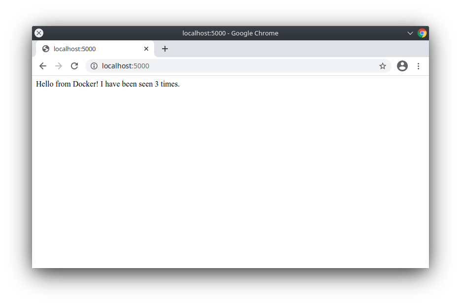

이번 장에서는 Docker Compose를 이용해서 간단한 파이썬 웹 어플리케이션을 만들어보겠습니다.
어플리케이션은 Flask 프레임워크를 사용하며 Redis로 클릭수를 보관합니다.
샘플에서 파이썬을 쓰고는 있지만 익숙치 않더라도 걱정하지 않으셔도 됩니다.

## 사전요구사항

시작하기전 [Docker Engine](../get-docker.md)과 [Docker Compose](install.md)가 설치되어야 합니다.
Docker 이미지에서 사용할 예정이므로 파이썬과 Redis는 설치할 필요가 없습니다.

## 1단계 : 구성

어플리케이션의 종속성을 정의합니다.

1. 프로젝트의 디렉터리를 생성합니다.

   ```console
   $ mkdir composetest
   $ cd composetest
   ```

2. `app.py`라는 파일을 프로젝트 디렉터리에 생성하고 아래 내용을 복사합니다.

   ```python
   import time

   import redis
   from flask import Flask

   app = Flask(__name__)
   cache = redis.Redis(host='redis', port=6379)

   def get_hit_count():
       retries = 5
       while True:
           try:
               return cache.incr('hits')
           except redis.exceptions.ConnectionError as exc:
               if retries == 0:
                   raise exc
               retries -= 1
               time.sleep(0.5)

   @app.route('/')
   def hello():
       count = get_hit_count()
       return 'Hello World! I have been seen {} times.\n'.format(count)
    ```

   예제에서, `redis`는 어플리케이션 네트워크내 Redis 컨테이너의 호스트 이름입니다.
   Redis의 기본 포트인 `6379`를 사용할 것 입니다.

   > 일시적 오류 다루기
   >
   > `get_hit_count` 함수가 작성된 내용을 참고하시기 바랍니다.
   > Redis 서비스가 동작하지 않을 경우 반복하여 요청하도록 재시도 반복구문이 적용되어있습니다.
   > 이것은 어플리케이션이 온라인이 되도록 시작할 때 유용합니다.
   > 또한 어플리케이션이 동작중에 Redis 서비스의 재시작이 가능하도록 합니다.
   > 클러스터에서는 노드간의 일시적 연결 끊킴을 다루는데 도움이 됩니다.

3. `requirements.txt`라는 파일을 프로젝트 디렉터리에 생성하고 아래 내용을 복사합니다.

   ```text
   flask
   redis
   ```

## 단계 2 : Dockerfile 생성

이번 단계애서는 Docker 이미지를 만들 Dockerfile을 작성합니다.
이미지는 파이썬을 포함하여 어플리케이션에 필요한 종속성을 모두 포함합니다.

프로젝트 디렉터리에 `Dockerfile`을 생성하고 아래 내용을 복사합니다.

```dockerfile
FROM python:3.7-alpine
WORKDIR /code
ENV FLASK_APP=app.py
ENV FLASK_RUN_HOST=0.0.0.0
RUN apk add --no-cache gcc musl-dev linux-headers
COPY requirements.txt requirements.txt
RUN pip install -r requirements.txt
EXPOSE 5000
COPY . .
CMD ["flask", "run"]
```

이것은 Docker에게 다음을 지시합니다.

* 파이썬 3.7 이미지로 빌드를 시작합니다.
* `/code`로 작업 디렉터리를 설정합니다.
* `flask` 명령에서 사용할 환경변수를 설정합니다.
* gcc와 다른 종속성을 설치합니다.
* `requirements.txt`를 복사하고 파이썬 종속성을 설치합니다.
* 컨테이너에 5000번 포트로 수신받는다는 메타정보를 추가합니다.
* `.`로 프로젝트의 현재 디렉터리를 이미지내 작업경로인 `.`로 복사합니다.
* `flask run`을 컨테이너의 기본 명령어로 설정합니다.

Dockerfile을 작성하는 방법에 관련해서는 [Docker 사용자 가이드](../develop/index.md)나 [Dockerfile 참조](/engine/reference/builder/)를 참고하시기 바랍니다.

## 단계 3 : Compose 파일에 서비스를 정의

`docker-compose.yml`이라는 파일을 프로젝트 디렉터리에 생성하고 아래 내용을 복사합니다.

```yaml
version: "3.9"
services:
  web:
    build: .
    ports:
      - "5000:5000"
  redis:
    image: "redis:alpine"
```

이 Compose 파일은 `web`과 `redis`라는 두개의 서비스를 정의합니다. 

### Web 서비스

`web` 서비스는 현재 디렉터리에서 `Dockerfile`로 빌드한 이미지를 사용합니다.
컨테이너와 호스트 머신의 `5000` 포트를 노출하도록 바인딩 합니다.
예제 서비스에서는 Flask 웹 서비스의 기본 포트인 `5000`를 사용합니다.

### Redis 서비스

`redis` 서비스는 Docker Hub 레지스트리에서 공식 [Redis](https://registry.hub.docker.com/_/redis/) 이미지를 받아 사용합니다.

## 단계 4 : Compose로 빌드하고 실행

1. 프로젝트 디렉터리에서 `docker-compose up`으로 어플리케이션을 실행합니다.

   ```console
   $ docker-compose up

   Creating network "composetest_default" with the default driver
   Creating composetest_web_1 ...
   Creating composetest_redis_1 ...
   Creating composetest_web_1
   Creating composetest_redis_1 ... done
   Attaching to composetest_web_1, composetest_redis_1
   web_1    |  * Running on http://0.0.0.0:5000/ (Press CTRL+C to quit)
   redis_1  | 1:C 17 Aug 22:11:10.480 # oO0OoO0OoO0Oo Redis is starting oO0OoO0OoO0Oo
   redis_1  | 1:C 17 Aug 22:11:10.480 # Redis version=4.0.1, bits=64, commit=00000000, modified=0, pid=1, just started
   redis_1  | 1:C 17 Aug 22:11:10.480 # Warning: no config file specified, using the default config. In order to specify a config file use redis-server /path/to/redis.conf
   web_1    |  * Restarting with stat
   redis_1  | 1:M 17 Aug 22:11:10.483 * Running mode=standalone, port=6379.
   redis_1  | 1:M 17 Aug 22:11:10.483 # WARNING: The TCP backlog setting of 511 cannot be enforced because /proc/sys/net/core/somaxconn is set to the lower value of 128.
   web_1    |  * Debugger is active!
   redis_1  | 1:M 17 Aug 22:11:10.483 # Server initialized
   redis_1  | 1:M 17 Aug 22:11:10.483 # WARNING you have Transparent Huge Pages (THP) support enabled in your kernel. This will create latency and memory usage issues with Redis. To fix this issue run the command 'echo never > /sys/kernel/mm/transparent_hugepage/enabled' as root, and add it to your /etc/rc.local in order to retain the setting after a reboot. Redis must be restarted after THP is disabled.
   web_1    |  * Debugger PIN: 330-787-903
   redis_1  | 1:M 17 Aug 22:11:10.483 * Ready to accept connections
   ```

   Compose는 Redis 이미지를 다운받고 코드에서 이미지를 빌드하고 정의한 서비스를 시작합니다.
   이 경우, 코드는 빌드시 이미지안으로 정적 복사가 됩니다.

2. 브라우저에서 `http://localhost:5000/`를 입력하여 동작중인 어플리케이션을 봅시다.

   Linux, Docker Desktop for Mac, or Docker Desktop for Windows에서 Docker를 사용한다면 웹 어플리케이션이 Docker 데몬 호스트의 5000번 포트에서 수신받기 시작합니다.
   웹 브라우저에서 `http://localhost:5000`를 탐색하면 `Hello World` 메시지를 찾을 수 있습니다.
   만약 잘 안될 경우, `http://127.0.0.1:5000`으로 시도해보시기 바랍니다.

   맥이나 윈도우에서 Docker 머신을 사용중이면, `docker-machine ip MACHINE_VM`명령으로 Docker 호스트의 IP를 확인합니다.
   그리고나서 `http://MACHINE_VM_IP:5000`으로 브라우저에서 탐색합니다.

   브라우저에서 다음의 메시지를 확인할 수 있습니다.

   ```console
   Hello World! I have been seen 1 times.
   ```

   

3. 페이지를 갱신합니다.

   숫자가 증가합니다.

   ```console
   Hello World! I have been seen 2 times.
   ```

   

4. 다른 터미널 윈도우로 전환해서, `docker image ls`로 로컬 이미지를 조회합니다.

   지금은 이미지가 `redis`와 `web`이 있습니다.

   ```console
   $ docker image ls

   REPOSITORY        TAG           IMAGE ID      CREATED        SIZE
   composetest_web   latest        e2c21aa48cc1  4 minutes ago  93.8MB
   python            3.4-alpine    84e6077c7ab6  7 days ago     82.5MB
   redis             alpine        9d8fa9aa0e5b  3 weeks ago    27.5MB
   ```

   `docker inspect <tag or id>`로 이미지를 검증해볼 수 있습니다.

5. 어플리케이션을 종료하려면, 두번째 터미널의 프로젝트 디렉터리에서 `docker-compose down`을 실행합니다.
   또는 어플리케이션이 실행중인 원래 터미널에서 `CTRL+C`를 입력하면 됩니다.

## 단계 5: Compose 파일을 수정하여 마운트 바인딩 추가

프로젝트 디렉터리의 `docker-compose.yml` 파일을 수정하여 `web`서비스에 [마운트 바인딩](../storage/bind-mounts.md)을 추가합니다.

```yaml
version: "3.9"
services:
  web:
    build: .
    ports:
      - "5000:5000"
    volumes:
      - .:/code
    environment:
      FLASK_ENV: development
  redis:
    image: "redis:alpine"
```

`volumes`의 내용은 프로젝트 디렉터리(현재 디렉터리)를 컨테이너의 `/code`로 마운트 하는 것 입니다.
그래서 이미지를 재빌드 하지 않고 즉석에서 코드를 수정할 수 있게 합니다.
`environment`의 내용은 `FLASK_ENV`라는 환경변수를 설정해서 `flask run` 명령을 개발환경으로 실행하여 코드가 변경되면 재시작하도록 합니다.
이 모드는 필히 개발환경에서만 사용해야합니다.

## 단계 6: Compose로 다시 빌드 후 실행

프로젝트 디렉터리에서 `docker-compose up`를 입력해서 갱신된 Compose 파일로 어플리케이션을 빌드하고 실행합니다.

```console
$ docker-compose up

Creating network "composetest_default" with the default driver
Creating composetest_web_1 ...
Creating composetest_redis_1 ...
Creating composetest_web_1
Creating composetest_redis_1 ... done
Attaching to composetest_web_1, composetest_redis_1
web_1    |  * Running on http://0.0.0.0:5000/ (Press CTRL+C to quit)
...
```

`Hello World` 메시지가 브라우저에 표시되고 갱신하면 카운트가 증가하는지 확인합니다.

> 공유폴더, 볼륨, 마운트 바인딩
>
> * 프로젝트가 `Users` 디렉터리 (`cd ~`) 밖에 있는 경우, 사용할 Dockerfile과 볼륨의 드라이브나 경로가 공유되어야 합니다. 어플리케이션 파일이 없다고 오류가 발생할 경우, 볼륨 마운트가 거부되었거나 서비스 시작을 못하거나 파일 또는 드라이브 공유를 시도하는 것 입니다. 볼륨 마운트는 `C:\Users` (윈도우) 또는 `/Users` (맥) 밖에 있는 프로젝트의 공유 드라이브가 필요합니다. 그리고 Docker Desktop for Windows에서 [Linux 컨테이너](../docker-for-windows/index.md#switch-between-windows-and-linux-containers)를 사용할 경우 항상 필요합니다.
추가적인 정보로 Docker Desktop for Mac에서는 [File 공유](../docker-for-mac/index.md#file-sharing)를 참고하시기 바랍니다. 일반적인 예제는 [컨테이너에서 데이터 관리](../storage/volumes.md)를 참고하시기 바랍니다.
>
> * 만약 구형 윈도우 OS에서 Oracle VirtualBox를 사용할 경우, [VB trouble ticket](https://www.virtualbox.org/ticket/14920)의 내용과 같은 공유폴더 이슈에 직면하게 될 것 입니다. 최신 윈도우 시스템에서는 [Docker Desktop for Windows](../docker-for-windows/install.md)의 요구사항으로 VirtualBox가 필요하지 않습니다.

## 단계 7: 어플리케이션 갱신

볼륨을 사용해서 컨테이너안으로 어플리케이션 코드가 마운트 되었기 때문에, 이미지를 다시 빌드할 필요없이 코드를 수정하고 즉각적으로 변경을 볼 수 있습니다.

`app.py`에서 환영메시지를 변경하고 저장합니다.
예로들어, `Hello World!`를 `Hello from Docker!`로 변경합니다.

```python
return 'Hello from Docker! I have been seen {} times.\n'.format(count)
```

브라우저에 어플리케이션을 갱신합니다.
환영메시지가 갱신되었고 카운터는 계속 증가하게 됩니다.



## 단계 8: Step 8: 다른 명령 실험

서비스를 백그라운드에서 실행하려면 `docker-compose up` 명령에 `-d` 옵션("detached" 모드)을 추가합니다.
그리고 `docker-compose ps`로 현재 실행중인 것을 확인합니다.

```console
$ docker-compose up -d

Starting composetest_redis_1...
Starting composetest_web_1...

$ docker-compose ps

       Name                      Command               State           Ports         
-------------------------------------------------------------------------------------
composetest_redis_1   docker-entrypoint.sh redis ...   Up      6379/tcp              
composetest_web_1     flask run                        Up      0.0.0.0:5000->5000/tcp
```

`docker-compose run` 명령은 서비스에 일회성 명령어를 실행할 수 있습니다.
예로, `web` 서비스의 가능한 환경변수를 조회하려면 다음과 같이 실행합니다.

```console
$ docker-compose run web env
```

`docker-compose --help` 명령으로 가능한 명령을 볼 수 있습니다.
또한 bash나 zsh 쉘에 [명령어 자동완성](completion.md)을 설치하면 명령어 확인이 가능합니다.

`docker-compose up -d`로 시작하였다면 사용이 완료되어 서비스를 중지하려면 다음과 같이 하면 됩니다.

```console
$ docker-compose stop
```

`down` 명령으로 전체를 중단시키고 컨테이너 전부를 삭제할 수 있습니다.
`--volumes`를 추가하면 Redis 컨테이너에서 사용한 데이터볼륨까지 삭제할 수 있습니다.

```console
$ docker-compose down --volumes
```

여기까지 하시면, Compose가 어떻게 동작하는지에 대한 기본을 배우게 됩니다.


## 다음단계로

- 다음으로, [Compose를 활용한 샘플 어플리케이션](samples-for-compose.md)을 하세요
- [Compose의 전체 명령어를 살펴보세요](reference/index.md)
- [Compose 설정 파일 참조](compose-file/index.md)
- 볼륨과 마운트 바인딩에 대해 알아보고 싶으면, [Docker에서 데이터 관리](../storage/index.md)를 살펴보세요