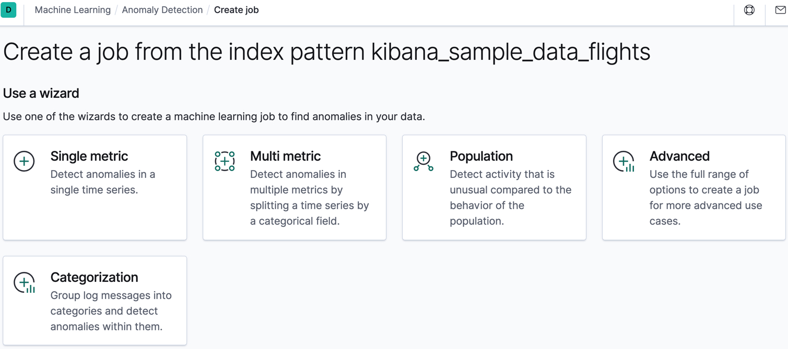
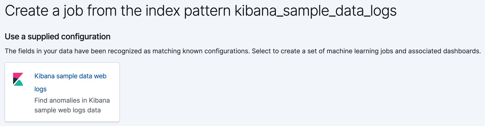
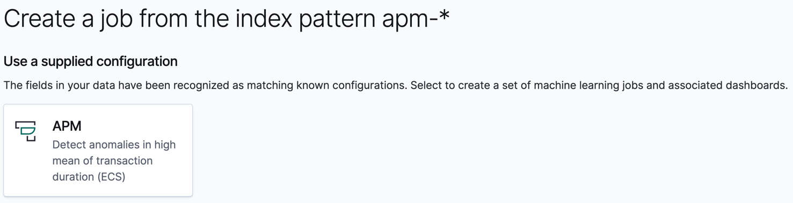
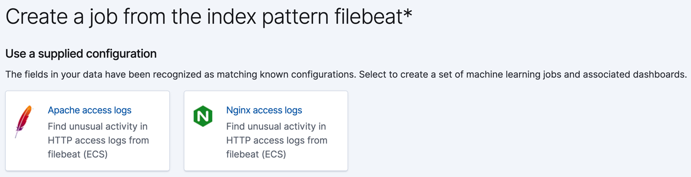
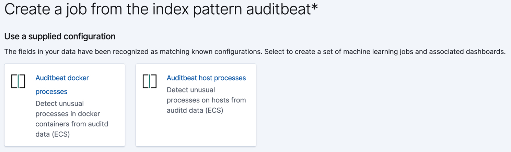
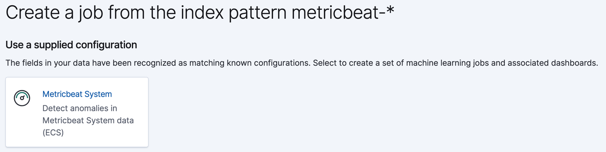

이상탐지 잡은 분석작업을 수행하기 위해 필요한 구성정보와 메타데이터를 포함하고 있습니다.

[이상탐지 잡 생성하기 API](ml-put-job.md)를 사용해서 이상탐지 잡을 만들 수 있습니다.
또한 키바나는 잡을 쉽게 생성할 수 있도록 아래의 마법사를 제공하고 있습니다.

단일메트릭 잡은 단일 디텍터를 가지는 단순한 잡입니다.
디텍터는 발생할 분석의 유형과 분석대상항목을 정의하는 것 입니다.
디텍터의 수를 제한하는 것 외에도 단일 메트릭 잡 생성 마법사는 고급 구성옵션의 많은 부분을 생략합니다.

다중메트릭 잡은 한개이상의 디텍터를 가질 수 있기 때문에 동일한 데이터에 대하여 다수의 잡을 효율적으로 수행할 수 있습니다.

모집단 잡은 모집단 행동내에 비교하여 특이한 행동을 감지하는 것 입니다.
자세한 정보는 [모집단 분석 수행하기](ml-configuring-populations.md)를 참고하세요.

분류 잡은 카테고리로 로그 메시지를 그룹화 하고 그안에 비정상을 감지하기 위해 [count](ml-count-functions.md)나 [rare](ml-rare-functions.md) 함수를 사용합니다.
[데이터의 비정상 카테고리 감지하기](ml-configuring-categories.md)를 참고하세요.

고급 잡은 다수의 디텍터를 가질 수 있고 모든 잡 설정을 활성화 할 수 있습니다.

키바나는 데이터의 특정 유형을 인지하고 컨텍스트에 맞는 특별한 위자드를 제공할 수 있습니다.
예로 들어, 샘플 웹 로그 데이터 집합을 추가하면 아래 위자드가 표시됩니다.

:::tip
대안으로 키바나 홈페이지에서 샘플 데이터 집합을 로드한 뒤, **View data > ML jobs** 를 클릭합니다.
샘플 전자상거래 주문 데이터 집합과 샘플 웹 로그 데이터 집합에 관련된 이상탐지 잡이 있습니다.
:::

엘라스틱 APM을 사용하면 키바나는 이 데이터를 감지하고 이상탐지 잡을 위한 마법사를 제공합니다.
예로 들면,

[Filebeat](https://www.elastic.co/guide/en/beats/filebeat/7.13/index.html)를 사용하여 [Nginx](http://nginx.org/)나 [Apache](https://httpd.apache.org/)의 HTTP 서버에 대한 접근로그를 엘라스틱서치에 보내서 [엘라스틱 공통 스키마(ECS)](https://www.elastic.co/guide/en/ecs/1.8/ecs-reference.html)의 항목과 데이터유형을 사용하여 저장하게 되면, 다음과 같은 마법사가 표시됩니다.

[Auditbeat](https://www.elastic.co/guide/en/beats/auditbeat/7.13/index.html)를 사용하여 시스템의 처리행동 감사를 할 경우 다음과 같은 마법사가 표시됩니다.

비슷하게, [Metricbeat 시스템 모듈](https://www.elastic.co/guide/en/beats/metricbeat/7.13/metricbeat-module-system.html)으로 서버를 모니터링하면 다음과 같은 마법사가 표시됩니다.

이러한 마법사는 Auditbeat, Filebeat, Metricbeat 데이터를 분석하는데 도움을 줄 수 있도록 사용자정의된 이상탐지 잡, 대시보드, 검색 및 시각화를 생성해줍니다.

:::note
데이터가 엘라스틱서치 밖에 존재한다면 잡을 생성하는데 키바나를 사용할 수 없고 데이터피드를 사용하여 실시간으로 데이터를 검색할 수 없습니다.
:::

## 머신러닝 잡 팁 {#job-tips}

키바나에서 이상탐지 잡을 생성할 때 잡 생성 마법사가 데이터의 특징 기반으로 조언을 제공할 수 있습니다.
이런 제안을 잘 활용하면 통찰력있는 머신러닝 결과를 생성할 가능성이 더 큰 잡을 만들 수 있습니다.

### 버킷 범위 {#bucket-span}

### 집합의 크기 {#cardinality}

### 디텍터 {#detectors}

### 인플루언서 {#influencers}

### 모델 메모리 제한 {#model-memory-limits}

### 전용 인덱스 {#dedicated-indices}

<AdsenseB />