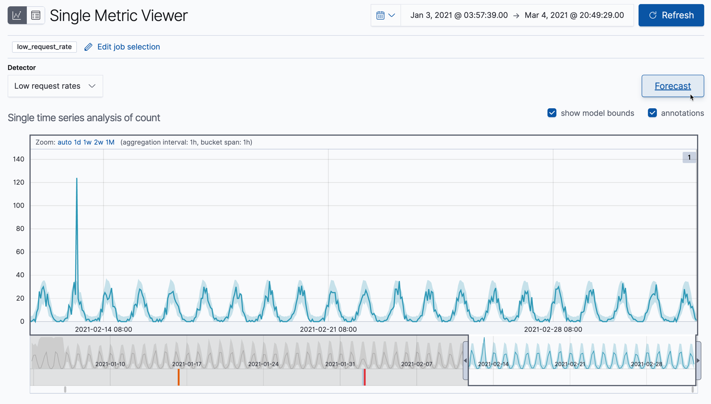
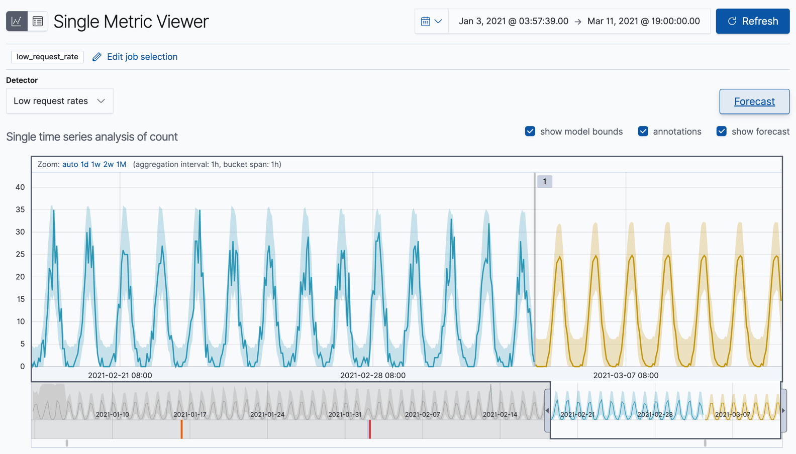

## 예측 생성하기

데이터에서 이상 행동을 감지하는것에 더하여 머신러닝 기능을 미래 행동을 예측하는데도 사용할 수 있습니다.

키바나에서 예측을 생성하려면,

1. **Single Metric Viewer** 에서 잡 결과(예로, `low_request_rate` 잡)를 봅니다.
  이 뷰를 찾으려면, **Anomaly Detection** 페이지의 **Actions** 컬럼에 있는 링크를 따라가면 됩니다.

2. **Forecast** 클릭하세요.

    

3. 예측 기간을 지정합니다.
  이 값은 처리된 마지막 레코드 이후로 추정거리를 가리킵니다.
  [시간 단위](https://www.elastic.co/guide/en/elasticsearch/reference/7.13/common-options.html#time-units)를 사용해야합니다.
  예제에서 기간은 1주 (`1w1`) 입니다.

    

4. **Single Metric Viewer** 에서 예측을 봅니다.

    

    차트의 노란선은 예측되는 데이터 값을 표현합니다.
    노란색 음영영역은 예측의 신뢰도를 나타내기도 하는 예측값의 범위를 표현합니다.
    더 많은 미래를 예측하기 때문에 범위는 일반적으로 시간에 따라 증가됩니다. (즉, 신뢰수준이 감소된다는 것 입니다)
    신뢰도가 너무 낮아지면 예측은 중단됩니다.

5. 선택적 : 실제 데이터와 예측을 비교하기

    

    잡이 더 많은 데이터를 처리하면, 다시 **Forecast** 버튼을 클릭할 수 있고 실제 데이터와 겹쳐서 예측의 하나를 선택하여 볼 수 있습니다.
    차트는 실제 데이터 값, 예상 값의 범위, 이상치, 예측 데이터 값, 예측의 범위를 포함합니다.
    실제와 예측 데이터의 조합을 통해 머신러닝 기능이 얼마나 데이터의 미래행동을 잘 추정했는지 보여줍니다.