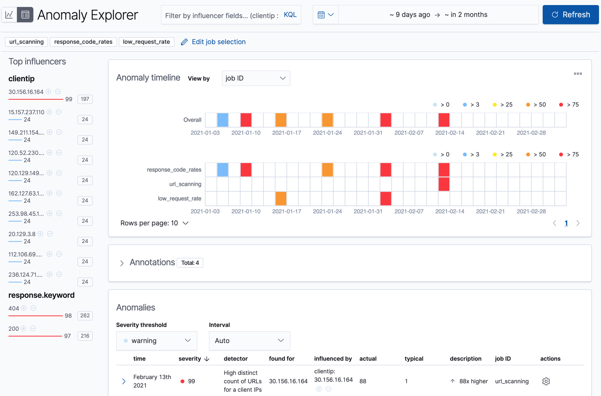
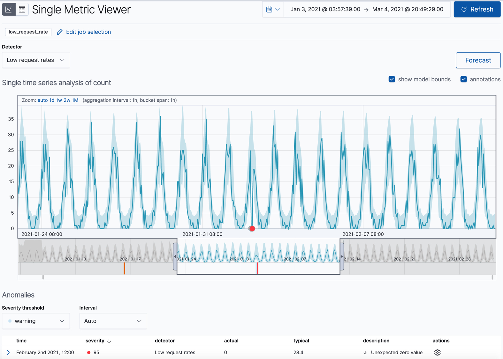
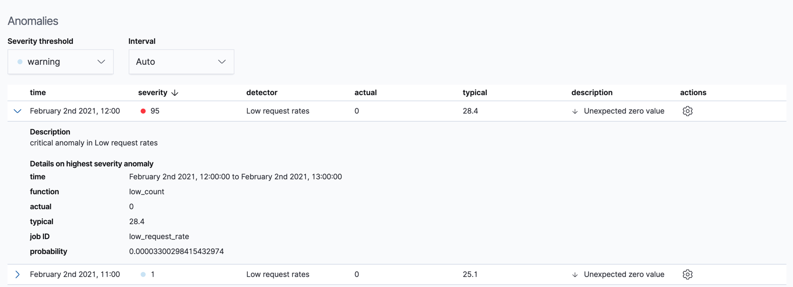
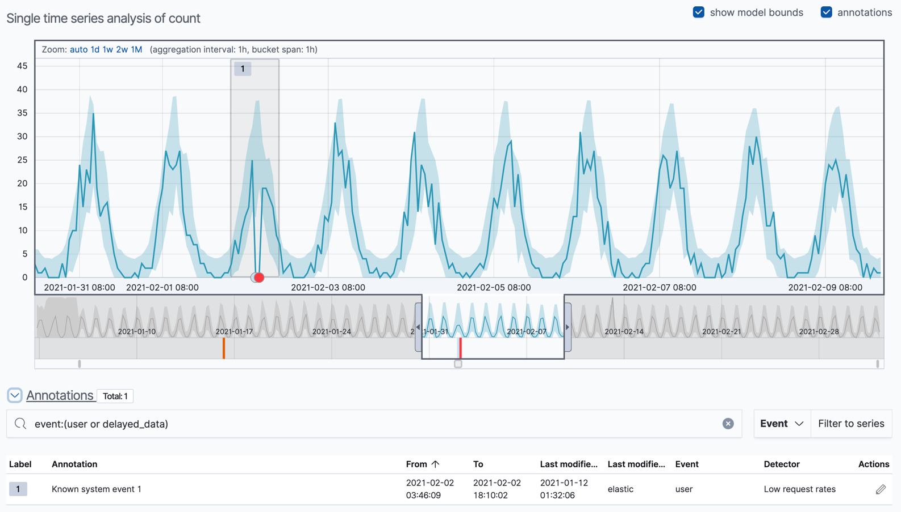

데이터피드가 시작되고 이상탐지 잡이 일부 데이터 처리가 완료되면 키바나에서 결과를 볼 수 있습니다.

:::tip
장치의 사양에 따라 초기 결과를 생성하기까지 머신러닝 분석을 몇초 동안 기다려야할 수 있습니다.
:::

머신러닝 기능은 데이터의 입력스트림을 분석하고 행동을 모델화 하여 각각 잡의 디텍터 기반으로 분석합니다.
모델 밖에서 이벤트가 발생하면 이벤트는 이상으로 식별됩니다.
바로 세개의 잡에서 표에서 빨간상자로 표시되는 이상들을 볼 수 있습니다.

키바나에는 이상 탐지 잡의 결과를 실험할 수 있는 두가지 도구가 있습니다.
**Anomaly Explorer** 와 **Single Metric Viewer** 입니다.
좌측 상단의 아이콘을 클릭하여 이 도구를 전환할 수 있습니다.
또한 이상 탐지 잡의 다른 부분을 실험하기 위해 잡을 선택할 수 있습니다.

## 단일측정항목 잡 결과

예제 잡의 하나( `low_request_rate` )는 단일측정항목 이상탐지 잡입니다.
`low_count` 함수를 사용한 단일 디텍터와 제한된 잡 속성을 가지고 있습니다.
웹 사이트에서 요청 비율이 상당히 떨어질 때를 결정하고자 할 경우 이 잡을 사용하면 됩니다.

**Single Metric Viewer** 에서 예제 잡을 한번 살펴보겠습니다.

1. 이상 탐지 잡 목록을 보기위해 **Machine Learning** 에서 **Anomaly Detection** 탭을 선택합니다.

2. **Single_Metric_Viewer** 에서 결과를 보기위해 `low_request_rate` 잡의 **Actions** 컬럼에 있는 차트 아이콘을 클릭합니다.

이 뷰는 시간기반 실제와 예측 값들을 표현하는 차트로 구성되어있습니다.
잡에서 `model_plot_config` 가 활성화되어있을 때만 가능합니다.
하나의 시계열만 표시가 가능합니다.

차트의 파란색 선은 실제 데이터 값을 표현합니다.
파란색 음영은 예측되는 값들의 범위를 나타냅니다.
영역의 최대/최소 범위는 모델에서 95%의 신뢰도 수준을 가지는 대부분의 값들 입니다.
만약 값이 이 범위를 벗어난다면 이상수치로 판별하게 됩니다.

시간 선택기를 데이터 시작부터 끝까지 슬라이드해보면 모델이 더 많은 데이터를 처리하면서 어떻게 개선되는지 볼 수 있습니다.
처음에는 값의 예상범위가 상당히 넓고 모델이 데이터의 주기성을 찾아내지 못했습니다.
그러나 빠르게 학습하여 데이터의 패턴을 반영하기 시작합니다.

:::tip
**이상 점수 (Anomaly Score)**

모델이 예측한 범위의 바깥 데이터 지점은 이상수치로 마킹됩니다.
결과의 현명한 뷰를 제공하기 위해 _이상 점수_ 는 각각 버킷 시간 간격으로 계산됩니다.
이상 점수는 0부터 100까지의 값을 가지며 이전에 표시된 이상수치와 비교하여 얼마만큼의 이상치를 가지는지 가리킵니다.
높은 이상수치 값은 빨간색으로 표시되며 낮은 이상수치는 파란색에 가깝습니다.
높은 이상점수의 구간은 중요하며 조사가 필요합니다.
:::

빨간 이상 데이터 지점을 포함한 시계열 구간으로 시간선택기를 슬라이드 합니다.
지점에 커서를 올리면 자세한 정보를 볼 수 있습니다.

:::note
시계열에 높은 고점을 확인할 수 있습니다.
이 잡은 적은 수만 살펴보기 때문에 이상으로 강조되지 않을 수 있습니다.
:::

뷰어의 **Anomalies** 영역에서 각 이상치의 시간, 실제/예상(일반적) 값, 확률 등에 대한 상세정보를 볼수 있습니다.
예로 들어,

**Actions** 열에 **Discover** 에서 연관된 문서를 위한 쿼리를 생성할 수 있는 **Row Data** 와 같은 추가적인 옵션이 있습니다.
[**custom URLs**](https://www.elastic.co/guide/en/machine-learning/7.17/ml-configuring-url.html)로 actions 메뉴에 추가적인 링크를 생성할 수도 있습니다.

기본적으로 테이블은 타임라인의 선택된 영역의 "warning" 또는 그 이상의 심각도를 가진 이상수치들을 포함하고 있습니다.
예로, 만약 critical 이상수치에만 관심이 있다면 이 테이블의 심각도 한계점을 변경하면 됩니다.

**Single Metric Viewer** 에서 시간 기간의 영역을 선택하여 잡의 결과에 설명을 포함한 선택적 주석을 달 수 있습니다.
주석은 특정 시간기간에 이벤트를 참고할 수 있도록 메모할 수 있습니다.
사용자가 생성하거나 이상 탐지 잡에서 모델의 변화, 주목할 사건을 반영하기 위해 자동으로 생성할 수 있습니다.

이상수치를 식별한 뒤, 보통의 다음단계는 그러한 상황의 맥락을 파악하는 것 입니다.
예로 들어, 문제에 기여하는 다른 요인이 있는지?
이상수치가 특정 어플리케이션이나 서버에 한정되어 있는지?
추가적인 잡을 계층화 하거나 다중측정항목 잡을 생성하여 이러한 상황을 트러블슈팅하도록 시작해야합니다.

## 전문가적 또는 다중측정항목 잡 결과

개념적으로 다중측정항목 이상 탐지 잡은 다수의 독립된 단일측정항목 잡을 수행하는 것으로 생각할 것 입니다.
그러나, 다중측정항목 잡으로 서로가 혼합되어 잡의 모든 측정항목과 엔티티의 전체적인 점수와 공유되는 인플루언서를 볼 수 있습니다.
따라서 다중측정항목 잡은 다수의 독립된 단일측정항목 잡을 가지는 것보다 더 확장되어집니다.
또한 디텍터간 공유되는 인플루언서를 가지고 있을 경우 더 좋은 결과를 제공할 수 있습니다.

:::tip
**인플루언서 (Influencers)**

이상 탐지 잡을 생성할 때 _인플루언서(influencers)_ 의 항목을 식별할 수 있습니다.
이것은 이상수치에 영향을 미치거나 기여하는 무언가에 대한 정보를 포함하고 있다고 생각되는 항목들 입니다.
`response_code_rates` 와 `url_scanning` 잡에 인플루언서가 있습니다.

모범사례로 많은 수의 인플루언서를 선택하지 마세요.
예로 들어, 보통 3개를 넘기지 않습니다.
많은 인플루언서를 선택하면 결과는 압도적이거나 분석에 약간의 오버헤드가 발생할 수 있습니다.
자세한 정보는 [인플루언서](https://www.elastic.co/guide/en/machine-learning/7.17/ml-influencers.html)를 참고하세요.
:::

## 모집단 잡 결과