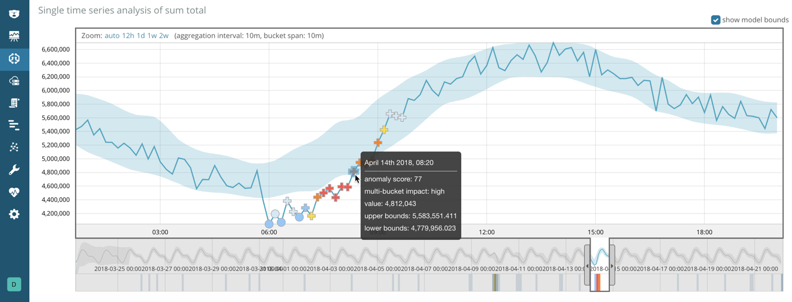

머신러닝 기능은 처리를 위한 배치단위로 시계열을 나누기 위하여 버킷이라는 개념을 사용합니다.

_버킷 범위_는 이상탐지 잡의 구성정보에 일부입니다.
데이터를 요약하고 모델링하기 위해 사용되는 시간의 간격을 정의합니다.
일반적으로 5분에서 1시간사이 이며 데이터의 특성에 따라 결정됩니다.
버킷 범위를 설정할 때 분석할 대상의 세분성, 입력 데이터의 빈도, 비정상의 일반적인 기간, 경고가 필요한 빈도를 고려해야 합니다.

## 버킷 결과 {#ml-bucket-results}

머신러닝 결과를 볼 때 각 버킷은 이상점수를 가지고 있습니다.
점수는 버킷에 있는 모든 레코드 결과의 결합된 비정상성에 대한 통계적으로 집계되고 정규화된 보기입니다.

머신러닝 분석은 인접한 버킷을 고려하여 각 버킷의 이상점수를 높입니다.
추가 다중버킷 분석은 각 버킷의 이벤트를 관련된 최근 이벤트의 큰 컨텍스트로 평가하기 위해 슬라이딩 윈도우를 효율적으로 사용합니다.
머신러닝결과를 검토할 때 최종 이상점수가 다중버킷 분석의 영향을 얼마나 강하게 받았는지 나타내는 `multi_bucket_impact` 속성이 있습니다.
키바나에서 중간 또는 상위 다중버킷에 영향을 가지는 이상치는 **Anomaly Explorer** 와 **Single Metric Viewer** 에서 점대신 십자가로 표시가 됩니다.

이 예제에서, 몇몇 이상치들이 예상되는 값들의 범주로 표현되는 파란 음영지역 안에 들어와있음을 볼 수 있습니다.
범주는 버킷마다 계산이 되지만 다중버킷 분석은 그 범위를 제한하지는 않습니다.

한개 이상의 이상탐지 잡을 가지고 있으면 다중 잡의 이상치를 전체적 점수로 조합하고 상관시키는 전체적 버킷 결과를 포함할 수 있습니다.
키바나에서 잡그룹의 결과를 볼 때 전체적 버킷 점수를 제공합니다.
자세한 정보는 [전체적 버킷 가져오기 API](ml-get-overall-buckets.md)를 참고하세요.

버킷결과는 이상탐지 잡의 최상위 수준 전체보기를 제공하여 알림에 이상적입니다.
예로 들어, 버킷결과는 16:05에 시스템이 비정상적이다고 알려주고 있습니다.
이 정보는 모든 이상치를 요약하고 언제발생했는지 파악합니다.
비정상적인 버킷을 식별할 때 관련 레코드를 검토하여 추가 조사를 수행할 수 있습니다.

<AdsenseB />