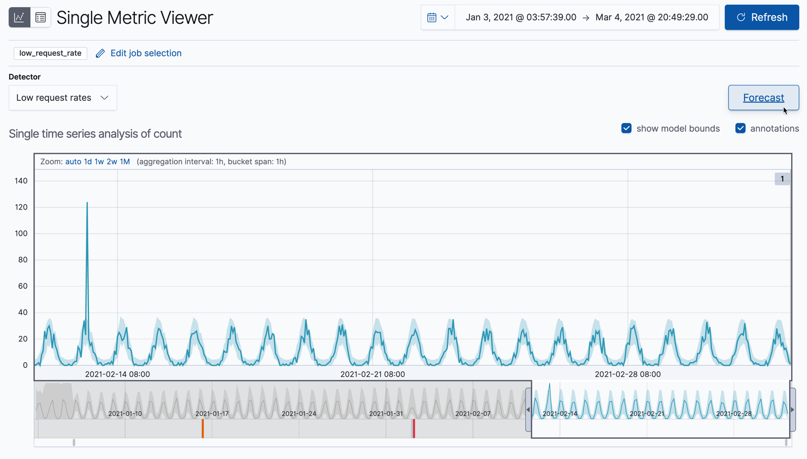
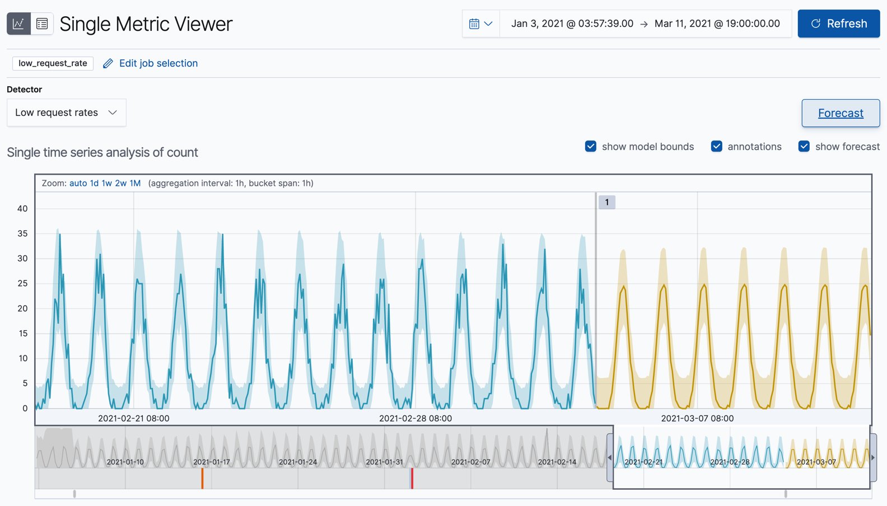
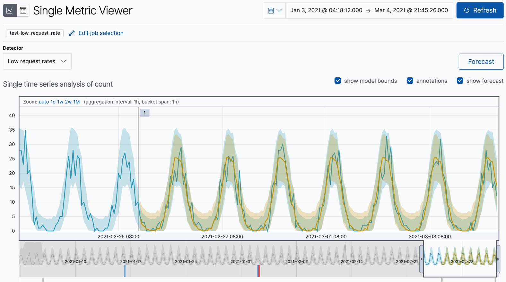

원문 : [https://www.elastic.co/guide/en/machine-learning/7.13/ml-gs-forecasts.html](https://www.elastic.co/guide/en/machine-learning/7.13/ml-gs-forecasts.html)

데이터에서 이상 행동을 감지하는것에 더하여 머신러닝 기능을 미래 행동을 예측하는데도 사용할 수 있습니다.

키바나에서 예측을 생성하려면,

1. **Single Metric Viewer** 에서 잡 결과(예로, `low_request_rate` 잡)를 봅니다.
  이 뷰를 찾으려면, **Anomaly Detection** 페이지의 **Actions** 컬럼에 있는 링크를 따라가면 됩니다.

2. **Forecast** 클릭하세요.

    

3. 예측 기간을 지정합니다.
  이 값은 처리된 마지막 레코드 이후로 추정거리를 가리킵니다.
  [시간 단위](https://www.elastic.co/guide/en/elasticsearch/reference/7.13/common-options.html#time-units)를 사용해야합니다.
  예제에서 기간은 1주 (`1w1`) 입니다.

    

4. **Single Metric Viewer** 에서 예측을 봅니다.

    

    차트의 노란선은 예측되는 데이터 값을 표현합니다.
    노란색 음영영역은 예측의 신뢰도를 나타내기도 하는 예측값의 범위를 표현합니다.
    더 많은 미래를 예측하기 때문에 범위는 일반적으로 시간에 따라 증가됩니다. (즉, 신뢰수준이 감소된다는 것 입니다)
    신뢰도가 너무 낮아지면 예측은 중단됩니다.

5. 선택적 : 실제 데이터와 예측을 비교하기

    

    잡이 더 많은 데이터를 처리하면, 다시 **Forecast** 버튼을 클릭할 수 있고 실제 데이터와 겹쳐서 예측의 하나를 선택하여 볼 수 있습니다.
    차트는 실제 데이터 값, 예상 값의 범위, 이상치, 예측 데이터 값, 예측의 범위를 포함합니다.
    실제와 예측 데이터의 조합을 통해 머신러닝 기능이 얼마나 데이터의 미래행동을 잘 추정했는지 보여줍니다.

    키바나 샘플 데이터에 대해 이 비교를 생성하려면, 작업을 생성할 때 데이터의 하위집합만 사용하세요.
    예로, 이상 탐지 잡 생성하기 스텝을 따르되 다른 잡 ID 접두어를 추가하고 **Use full kibana_sample_data_logs data** 옵션을 해제하세요.
    샘플데이터를 통해 날짜를 종료날짜로 선택하세요.
    기본적으로 해당 날짜에 도달하면 데이터피드는 중지되고 이상탐지 잡은 닫히게 됩니다.
    예측을 생성하세요.
    그런다음 데이터피드를 다시 시작하여 나머지 데이터를 처리하고 여기에 결과의 유형을 생성할 수 있습니다.

    :::tip
    키바나 샘플데이터 셋은 데이터세트를 추가한 시점과 연관된 타임스탬프가 있습니다.
    그러나, 이러한 날짜 중 일부는 미래의 날짜입니다.
    따라서, 튜토리얼의 목적을 위해 데이터 피드를 다시 시작할 때 **No end time(실시간 검색)** 옵션을 사용하지 마세요.
    모든 데이터를 즉시 처리할 수 있도록 적절한 종료 시간을 지정하세요.
    :::

이제 샘플 데이터로 예측을 생성하는게 얼마나 쉬운지 살펴보았으므로, 자체 데이터에서 어떤 유형의 이벤트를 예측할 수 있는지 고려해보세요.
예측에 관련된 더 많은 정보와 아이디어 및 한계점 목록은 [미래 예측하기](./ml-overview.md#ml-forecasting)를 참고하세요.