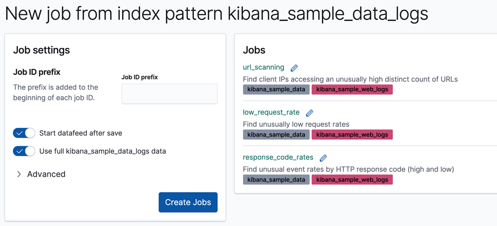

원문 : [https://www.elastic.co/guide/en/machine-learning/7.13/ml-gs-jobs.html](https://www.elastic.co/guide/en/machine-learning/7.13/ml-gs-jobs.html)

키바나 샘플 데이터 셋은 체험할 수 있도록 몇몇 사전구성된 이상탐지 잡을 포함하고 있습니다.
잡을 추가하기 위해 아래의 방법 또한 사용할 수 있습니다.

* 키바나 홈페이지에서 샘플 웹 로그 데이터 셋을 불러온 뒤, **View Data > ML jobs** 를 클릭합니다.

* 머신 러닝 앱에서 **Data Visualizer** 또는 **Anomaly Detection** 잡 마법사에서 `kibana_sample_data_logs` 인덱스 패턴을 선택할 때 알려진 구성을 사용하여 잡을 생성할 것인지 추천합니다.
  **Kibana sample data web logs** 구성을 선택합니다.

기본값을 선택하고 **Create Jobs** 를 클릭합니다.

마법사는 3개의 잡과 3개의 데이터피드를 생성합니다.

:::tip
**데이터피드, 버킷, 디텍터**

데이터피드는 엘라스틱서치의 시계열 데이터를 가리키며 이상탐지 잡에 분석을 위해 제공됩니다.

잡은 처리를 위한 배치로 시계열로 분할한 버킷을 사용합니다.
예로 들어, 3개의 예제 웹 로그 잡은 1시간 단위로 버킷을 사용합니다.

각각 이상탐지 잡은 한개 이상의 디텍터를 포함하고 있으며 발생할 분석의 유형(예로, `max`, `average`, `rare`와 같은 분석적 함수)과 분석될 항목을 정의합니다.
분석적 함수 일부는 단일 변칙 데이터 지점을 살펴봅니다.
예로 들어, `max` 는 버킷내 최대값을 식별합니다.
다른 것은 버킷 길이 전반적으로 몇몇 집합을 수행합니다.
예로 들어, `mean` 은 버킷내 보이는 모든 데이터 지점의 평균을 계산합니다.

자세한 정보는 [데이터피드](https://www.elastic.co/guide/en/machine-learning/7.17/ml-datafeeds.html), [버킷](https://www.elastic.co/guide/en/machine-learning/7.17/ml-buckets.html), [함수 참조](https://www.elastic.co/guide/en/machine-learning/7.17/ml-functions.html)를 보세요.
:::

잡과 데이터피드에 대한 상세 구성을 보고 싶을 경우 **Machine Learning > Anomaly Detection > Job Management** 페이지를 참고하세요.
또는 [깃허브](https://github.com/elastic/kibana/tree/7.17/x-pack/plugins/ml/server/models/data_recognizer/modules/sample_data_weblogs)에서 구성파일을 살펴볼 수 있습니다.
이번 튜토리얼 목적에 맞게 각각 잡의 목표를 빠르게 살펴보겠습니다.

* `low_request_rate` 는 `low_count` 함수를 사용하여 흔치않은 낮은 요청비율을 찾습니다.
* `response_code_rates` 는 `count` 함수를 사용하고 `response.keyword` 값으로 분석을 분할해서 HTTP 응답코드의 비정상적 이벤트 비율을 찾습니다.
* `url_scanning` 은 `high_distinct_count` 함수를 사용하고 `clientip` 항목의 모집단 분석을 수행하여 비정상적으로 높은 고유한 수의 URL에 접근하는 클라이언트 IP를 찾습니다.

다음 단계는 결과를 보고 3개의 잡에서 생성된 인사이트의 유형을 살펴보겠습니다.