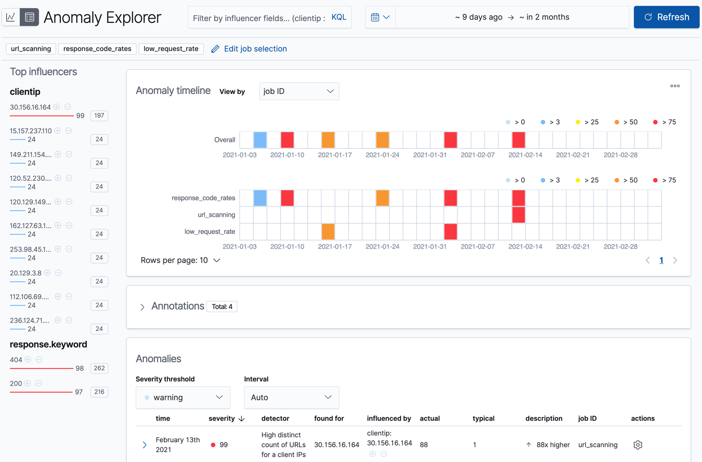
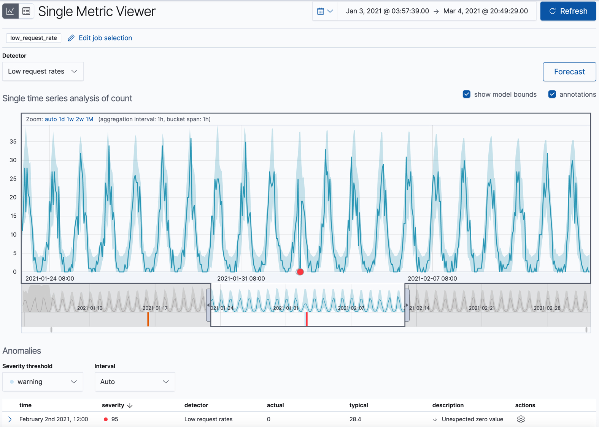
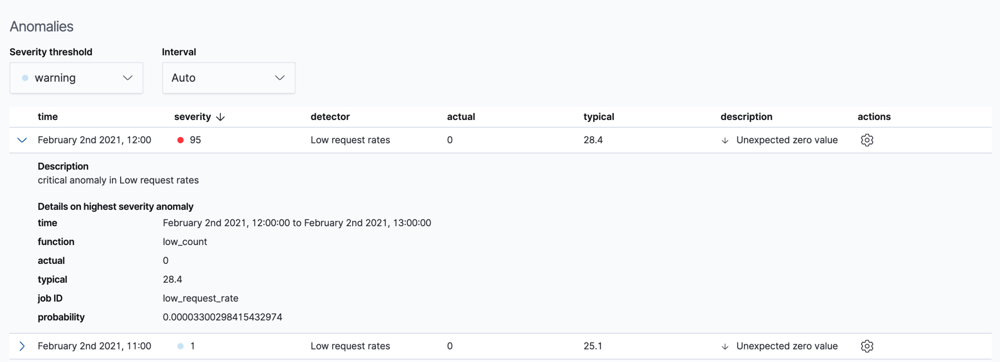
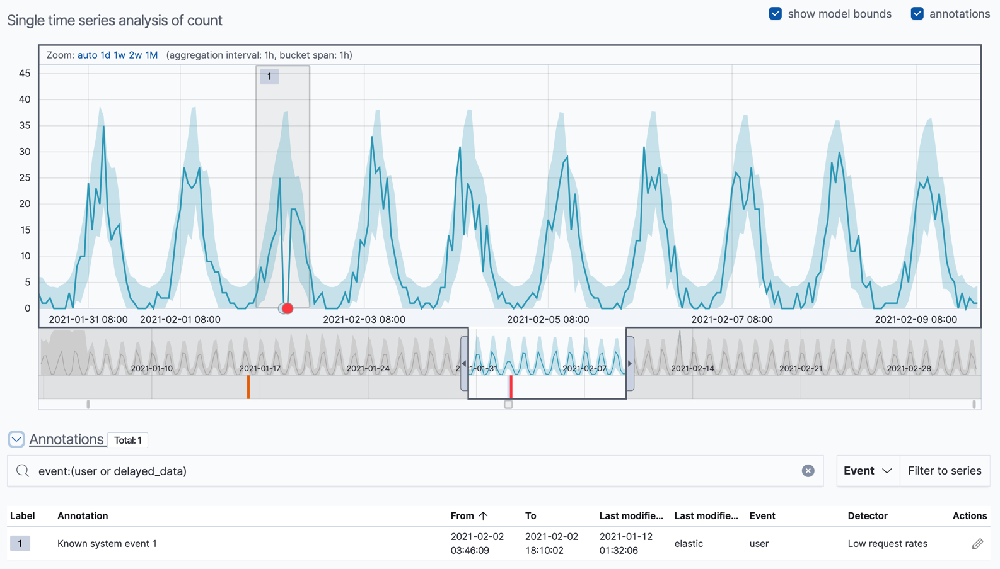
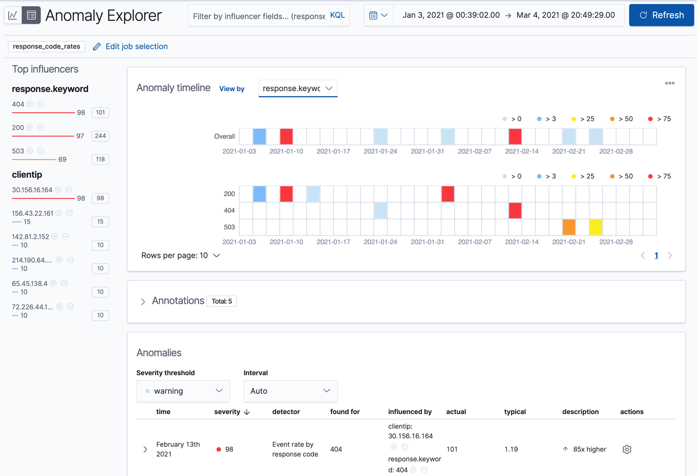
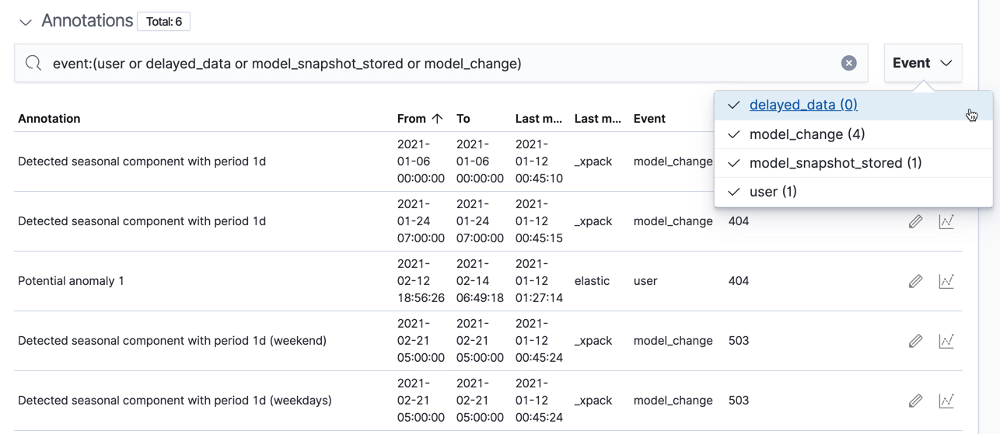
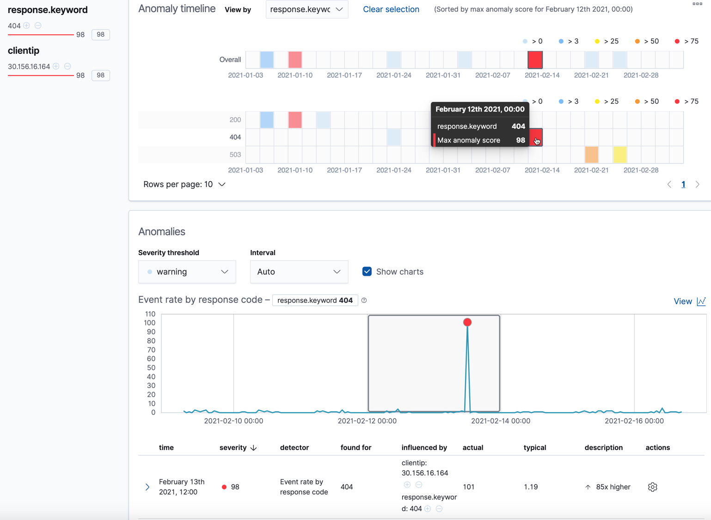
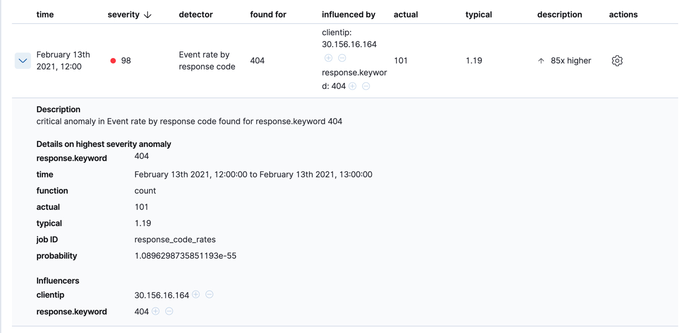
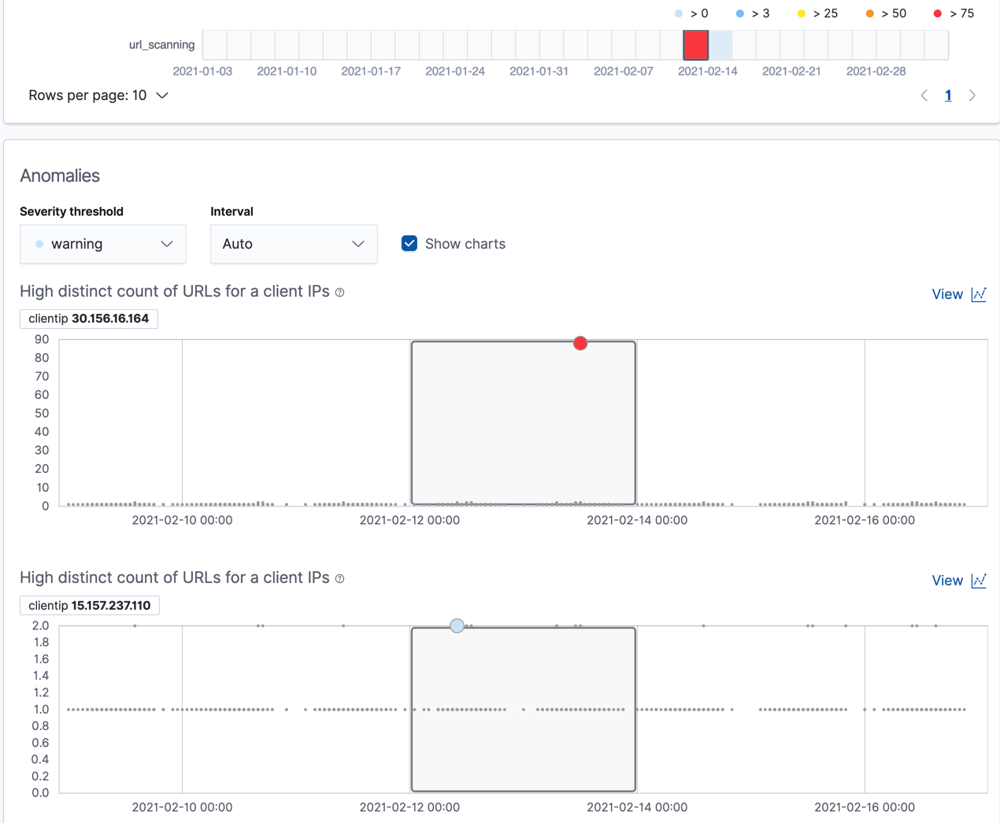
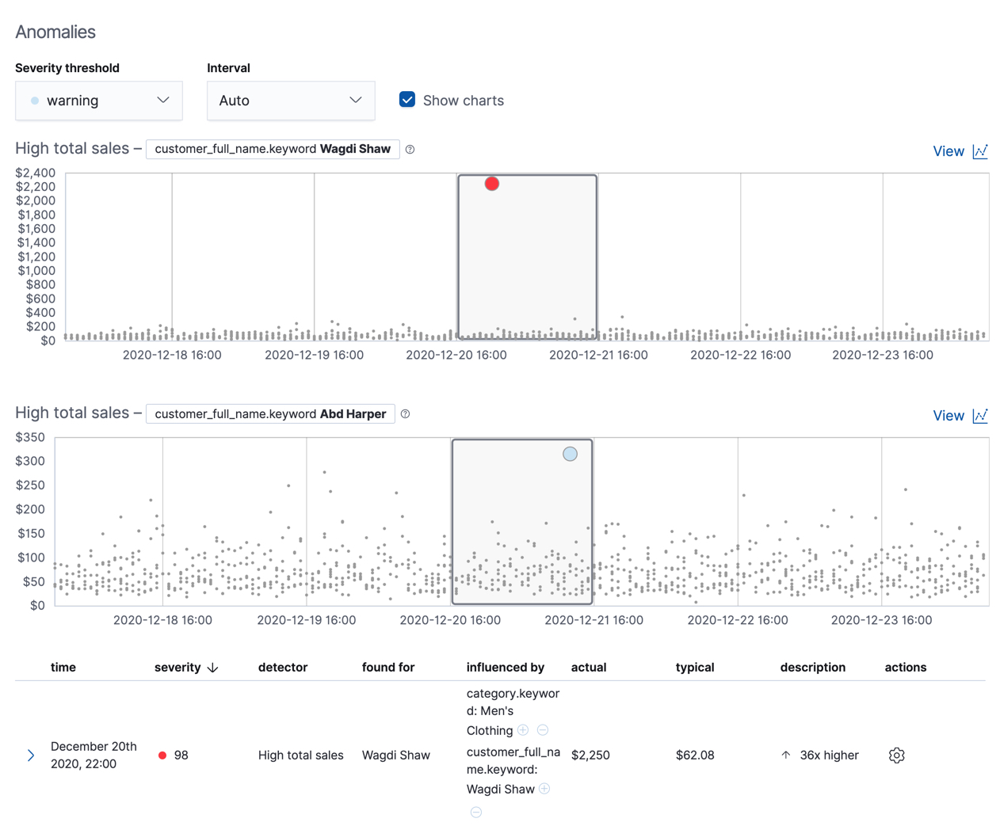

원문 : [https://www.elastic.co/guide/en/machine-learning/7.13/ml-gs-results.html](https://www.elastic.co/guide/en/machine-learning/7.13/ml-gs-results.html)

데이터피드가 시작되고 이상탐지 잡이 일부 데이터 처리가 완료되면 키바나에서 결과를 볼 수 있습니다.

:::tip
장치의 사양에 따라 초기 결과를 생성하기까지 머신러닝 분석을 몇초 동안 기다려야할 수 있습니다.
:::

머신러닝 기능은 데이터의 입력스트림을 분석하고 행동을 모델화 하여 각각 잡의 디텍터 기반으로 분석합니다.
모델 밖에서 이벤트가 발생하면 이벤트는 이상으로 식별됩니다.
바로 세개의 잡에서 표에서 빨간상자로 표시되는 이상들을 볼 수 있습니다.

키바나에는 이상탐지 잡의 결과를 실험할 수 있는 두가지 도구가 있습니다.
**Anomaly Explorer** 와 **Single Metric Viewer** 입니다.
좌측 상단의 아이콘을 클릭하여 이 도구를 전환할 수 있습니다.
또한 이상탐지 잡의 다른 부분을 실험하기 위해 잡을 선택할 수 있습니다.

## 단일측정항목 잡 결과 {ml-gs-results-smv}

예제 잡의 하나( `low_request_rate` )는 단일측정항목 이상탐지 잡입니다.
`low_count` 함수를 사용한 단일 디텍터와 제한된 잡 속성을 가지고 있습니다.
웹 사이트에서 요청 비율이 상당히 떨어질 때를 결정하고자 할 경우 이 잡을 사용하면 됩니다.

**Single Metric Viewer** 에서 예제 잡을 한번 살펴보겠습니다.

1. 이상탐지 잡 목록을 보기위해 **Machine Learning** 에서 **Anomaly Detection** 탭을 선택합니다.

2. **Single_Metric_Viewer** 에서 결과를 보기위해 `low_request_rate` 잡의 **Actions** 컬럼에 있는 차트 아이콘을 클릭합니다.

이 뷰는 시간기반 실제와 예측 값들을 표현하는 차트로 구성되어있습니다.
잡에서 `model_plot_config` 가 활성화되어있을 때만 가능합니다.
하나의 시계열만 표시가 가능합니다.

차트의 파란색 선은 실제 데이터 값을 표현합니다.
파란색 음영은 예측되는 값들의 범위를 나타냅니다.
영역의 최대/최소 범위는 모델에서 95%의 신뢰도 수준을 가지는 대부분의 값들 입니다.
만약 값이 이 범위를 벗어난다면 이상수치로 판별하게 됩니다.

시간 선택기를 데이터 시작부터 끝까지 슬라이드해보면 모델이 더 많은 데이터를 처리하면서 어떻게 개선되는지 볼 수 있습니다.
처음에는 값의 예상범위가 상당히 넓고 모델이 데이터의 주기성을 찾아내지 못했습니다.
그러나 빠르게 학습하여 데이터의 패턴을 반영하기 시작합니다.

:::tip
**이상 점수 (Anomaly Score)**

모델이 예측한 범위의 바깥 데이터 지점은 이상수치로 마킹됩니다.
결과의 현명한 뷰를 제공하기 위해 _이상 점수_ 는 각각 버킷 시간 간격으로 계산됩니다.
이상 점수는 0부터 100까지의 값을 가지며 이전에 표시된 이상수치와 비교하여 얼마만큼의 이상치를 가지는지 가리킵니다.
높은 이상수치 값은 빨간색으로 표시되며 낮은 이상수치는 파란색에 가깝습니다.
높은 이상점수의 구간은 중요하며 조사가 필요합니다.
:::

빨간 이상 데이터 지점을 포함한 시계열 구간으로 시간선택기를 슬라이드 합니다.
지점에 커서를 올리면 자세한 정보를 볼 수 있습니다.

:::note
시계열에 높은 고점을 확인할 수 있습니다.
이 잡은 적은 수만 살펴보기 때문에 이상으로 강조되지 않을 수 있습니다.
:::

뷰어의 **Anomalies** 영역에서 각 이상치의 시간, 실제/예상(일반적) 값, 확률 등에 대한 상세정보를 볼수 있습니다.
예로 들어,

**Actions** 열에 **Discover** 에서 연관된 문서를 위한 쿼리를 생성할 수 있는 **Row Data** 와 같은 추가적인 옵션이 있습니다.
[**custom URLs**](https://www.elastic.co/guide/en/machine-learning/7.17/ml-configuring-url.html)로 actions 메뉴에 추가적인 링크를 생성할 수도 있습니다.

기본적으로 테이블은 타임라인의 선택된 영역의 "warning" 또는 그 이상의 심각도를 가진 이상수치들을 포함하고 있습니다.
예로, 만약 critical 이상수치에만 관심이 있다면 이 테이블의 심각도 한계점을 변경하면 됩니다.

**Single Metric Viewer** 에서 시간 기간의 영역을 선택하여 잡의 결과에 설명을 포함한 선택적 주석을 달 수 있습니다.
주석은 특정 시간기간에 이벤트를 참고할 수 있도록 메모할 수 있습니다.
사용자가 생성하거나 이상탐지 잡에서 모델의 변화, 주목할 사건을 반영하기 위해 자동으로 생성할 수 있습니다.

이상수치를 식별한 뒤, 보통의 다음단계는 그러한 상황의 맥락을 파악하는 것 입니다.
예로 들어, 문제에 기여하는 다른 요인이 있는지?
이상수치가 특정 어플리케이션이나 서버에 한정되어 있는지?
추가적인 잡을 계층화 하거나 다중측정항목 잡을 생성하여 이러한 상황을 트러블슈팅하도록 시작해야합니다.

## 전문가적 또는 다중측정항목 잡 결과 {ml-gs-results-ae}

개념적으로 다중측정항목 이상탐지 잡은 다수의 독립된 단일측정항목 잡을 수행하는 것으로 생각할 것 입니다.
그러나, 다중측정항목 잡으로 서로가 혼합되어 잡의 모든 측정항목과 엔티티의 전체적인 점수와 공유되는 인플루언서를 볼 수 있습니다.
따라서 다중측정항목 잡은 다수의 독립된 단일측정항목 잡을 가지는 것보다 더 확장되어집니다.
또한 디텍터간 공유되는 인플루언서를 가지고 있을 경우 더 좋은 결과를 제공할 수 있습니다.

:::tip
**인플루언서 (Influencers)**

이상탐지 잡을 생성할 때 _인플루언서(influencers)_ 의 항목을 식별할 수 있습니다.
이것은 이상수치에 영향을 미치거나 기여하는 무언가에 대한 정보를 포함하고 있다고 생각되는 항목들 입니다.
`response_code_rates` 와 `url_scanning` 잡에 인플루언서가 있습니다.

모범사례로 많은 수의 인플루언서를 선택하지 마세요.
예로 들어, 보통 3개를 넘기지 않습니다.
많은 인플루언서를 선택하면 결과는 압도적이거나 분석에 약간의 오버헤드가 발생할 수 있습니다.
자세한 정보는 [인플루언서](https://www.elastic.co/guide/en/machine-learning/7.17/ml-influencers.html)를 참고하세요.
:::

또한 단일 시계열을 범주형 필드 기반으로 다중 시계열으로 분할할 수 있는 이상탐지 잡을 구성할 수 있습니다.
예로 들어, `response_code_rates` 잡은 `response.keyword` 에 기반해 데이터를 분할하고 이벤트의 수가 이상한지를 판별하는데  `count` 함수를 사용합니다.
응답코드로 파티셔닝하여 높고 낮은 요청비율 모두 살펴보기를 원한다면 이와 같이 잡을 사용하면 됩니다.

**Anomaly Explorer** 에서 `response_code_rates` 잡을 살펴보겠습니다.

1. **Machine Learning** 의 **Anomaly Detection** 탭을 선택하여 이상탐지 잡 목록을 보겠습니다.
2. **Anomaly Explorer** 에서 `response_code_rates` 잡의 **Actions** 컬럼에 있는 격자 아이콘을 클릭하여 결과를 보겠습니다.

이 특정 잡에 대해, 각 클라이언트 IP나 응답코드에 대해 별도의 분리된 그래프에서 볼수 있게 고를 수 있습니다.

잡이 `response.keyword` 를 파티션 항목으로 사용했기때문에 분석은 그 항목의 유일한 값 각각에 완전히 다른 기준선을 가지게 되어 세분화 됩니다.
엔티티별로 시간 패턴을 살펴보면 일괄보기에 숨겨져 있는 항목을 찾을 수 있습니다.

이상 타임라인 아래 어노테이션 섹션이 있습니다.
**Annotations** 섹션의 좌측에 있는 선택박스를 사용하여 이벤트의 타입으로 필터할 수 있습니다.

**Anomaly Explorer**의 왼쪽에는 동일한 시간 기간에 감지된 이상치의 상위 인플루언서 목록이 있습니다.
목록에는 모든 디텍터에서 각 인플루언서별, 버킷별 집계가 되는 최대 이상 점수가 포함됩니다.
또한 각 인플루언서별 이상 점수의 전체 합이 있습니다.
이 목록을 사용하여 기여 요인에 범위를 좁히고 가장 이상 엔티티에 집중할 수 있습니다.

그래프의 섹션을 클릭해서 해당 시간 기간에 대한 이상들에 대한 상세한 정보를 얻을 수 있습니다.
예로 들어, `response.keyword`의 값이 `404`인 그래프의 빨간섹션을 클릭합니다.

이상이 언제 발생했는지에 대한 정확한 시간을 볼 수 있습니다.
잡에 다수의 디텍터나 매트릭이 있는 경우 어떤게 이상의 원인이 되는지 볼 수 있습니다.
또한 이 시계열을 **Single Metric Viewer** 에서 볼 수 있도록 전환할 수 있습니다.

차트 아래에 평상시와 실제 값, 이상에 기여한 인플루언서 등과 같은 제공되는 상세한 정보의 테이블이 있습니다.
예로 들어, 아래 그림과 같습니다.

잡이 다수의 디텍터를 가진다면, 디텍터마다 최고 심각도의 이상치와 **found for** 열에 표시되는 항목 값인 엔티티를 보여주기 위해 테이블이 이상을 집계합니다.
집계없이 모든 이상을 보려면 **Interval**을 `Show all`로 설정합니다.

동일한 데이터에서 404 응답코드에 스파이크는 특정 클라이언트에 영향을 받습니다.
이러한 상황은 클라이언트가 비정상적 페이지를 접속하거나 비정상적 URL에 접속하기 위해 사이트를 스캐닝하는 것 입니다.
이러한 이상 행동은 추가 조사가 필요합니다.

:::tip
**Anomaly Expolrer**의 각 섹션에 볼 수 있는 이상 점수는 약간 다를 수 있습니다.
각 잡에 대한 버킷 결과, 인플루언서 결과 및 레코드 결과가 있기 때문에 이러한 불일치가 발생합니다.
각 결과 유형에 대해 이상 점수가 생성됩니다.
이상 타임라인은 버킷 수준의 이상 점수를 사용합니다.
상위 인플루언서 목록은 인플루언서 수준의 이상 점수를 사용합니다.
이상 목록은 레코드 수준의 이상 점수를 사용합니다.
:::

## 모집단 잡 결과 {ml-gs-results-population}

마지막 샘플 잡 (`url_scanning`) 은 모집단 이상탐지 잡 입니다.
`response_code_rates` 잡 결과에서 보듯 몇몇 클라이언트가 비정상적으로 많은 수의 URL에 접근합니다.
`url_scanning` 샘플 잡은 그런 유형의 문제를 조사하기 위해 다른 방법을 제공합니다.
`url.keyword`에 `high_distinct_count` 함수를 사용한 단일 디텍터를 가지고 있으며 해당 항목에 대한 비정상적으로 많은 수의 고유값을 감지합니다.
그런 다음 `clientip` 항목에 정의된 대로 동작이 모집단의 클라이언트에 따라 다른지 분석합니다.

**Anomaly Explorer** 의 `url_scanning` 이상탐지 잡에서 결과를 검사하면 차트가 다른 형식을 가지고 있음을 알게 될 것이다.
예로 들어,

이 경우, 각각 클라이언트 IP의 지표는 각 버킷의 다른 클라이언트 IP에 대해 분석됩니다.
그리고 `30.156.16.164` 클라이언트 IP가 비정상적 행동을 하고 있음을 볼 수 있습니다.

모집단 이상탐지 잡의 다른 예제로 하고 싶으면 예제 이커머스 주문 데이터 셋을 추가하세요.
`high_sum_total_sales` 잡은 각 시간 버킷에 다른 고객에 비해 비정상적으로 구매한 고객을 판별합니다.
이 예제에서 두명의 고객이 이상 이벤트로 감지됩니다.

더 자세한 정보는 [모집단 분석 수행하기](https://www.elastic.co/guide/en/machine-learning/7.13/ml-configuring-populations.html)를 참고하세요.