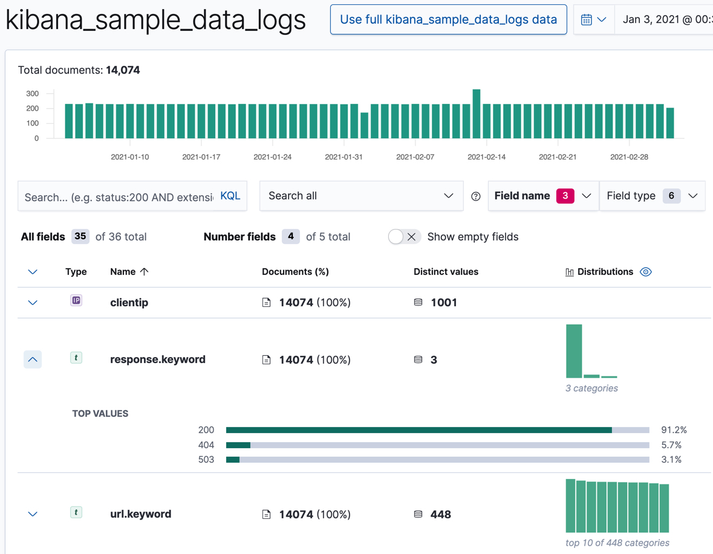
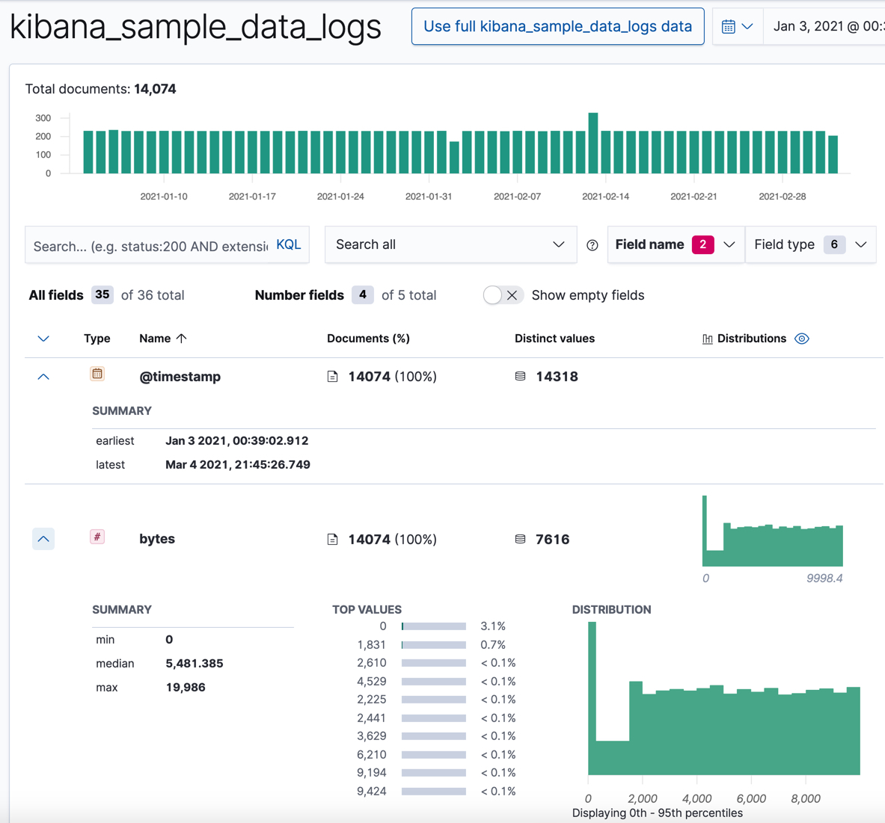

원문 : [https://www.elastic.co/guide/en/machine-learning/7.13/ml-gs-visualizer.html](https://www.elastic.co/guide/en/machine-learning/7.13/ml-gs-visualizer.html)

머신러닝 분석으로 최상의 결과를 얻으려면, 데이터를 먼저 이해해야 합니다.
데이터 타입과 값의 범위, 분포를 알고 있어야 합니다.
Data Visualizer는 데이터의 항목을 조회할 수 있게 해줍니다.

1. 키바나를 웹브라우저로 엽니다.
  키바나를 로컬에서 실행하고 있다면 `http://localhost:5601/`으로 접속합니다.

    :::tip
    키바나 머신러닝 기능은 팝업을 사용합니다.
    웹브라우저에서 팝업 윈도우 차단을 사용하지 않거나, 키바나 URL을 예외처리하도록 합니다.
    :::

2. 좌측 네비게이션의 **Machine Learning** 을 클릭합니다.

3. **Data Visualizer** 탭을 선택합니다.

4. **Select index**를 클릭하고 `kibana_sample_data_logs` 인덱스 패턴을 선택합니다.

5. 타이머 필터를 활용하여 관심있게 탐색할 시간 구간을 선택합니다.
  대안으로 **Use full kibana_sample_data_logs data** 를 클릭하여 데이터의 전체 시간범위를 볼 수 있습니다.

6. 선택적으로 Data Visualizer 에서 사용할 단위당 문서의 수인 샘플 크기를 변경할 수 있습니다.
  키바나 샘플 데이터에 비교적 작은수의 문서가 있으므로 `all` 의 값을 선택해도 됩니다.
  큰 데이터 셋에서는 큰 샘플 크기를 사용하면 쿼리 수행 시간을 증가시키고 클러스터의 부하를 증가시킬 수 있다는 것을 알고있어야 합니다.

7. Data Visualizer에서 항목을 탐색합니다.

    항목 이름이나 [항목 유형](https://www.elastic.co/guide/en/elasticsearch/reference/7.17/mapping-types.html)으로 목록을 필터할 수 있습니다.
    Data Visualizer는 선택된 시간 범위의 샘플에서 얼마만큼의 문서가 각 항목을 포함하는지 가리킵니다.

    특히, 이상탐지 잡에서 사용할 `clientip`, `response.keyword`, `url.keyword`를 살펴보세요.
    이 항목에 대해 Data Visualizer에서 고유한 값의 수와 상위 값 목록, 해당 항목을 포함한 문서의 수와 비율을 제공합니다.
    예로 들어,

    

    수치 항목에서는 Data Visualizer가 최소값, 중앙값, 최대값, 상위 값, 고유한 값의 수, 분산에 대한 정보를 제공합니다.
    데이터에서 값이 어떻게 클러스터링 되어있는지에 대한 좋은 생각을 얻기 위해 분산 차트를 사용할 수도 있습니다.
    예로 들어,

    

    :::tip
    `@timestamp` 항목의 날짜 범위를 기억하세요.
    이것은 샘플 데이터를 추가한 시점과 관련이 있으며 나중에 튜토리얼에서 필요한 정보입니다.
    :::

이제, `kibana_sample_data_logs` 인덱스의 데이터에 대해 익숙해졌으며 몇가지 분석할 이상탐지 잡을 만들 수 있습니다.

<AdsenseB />