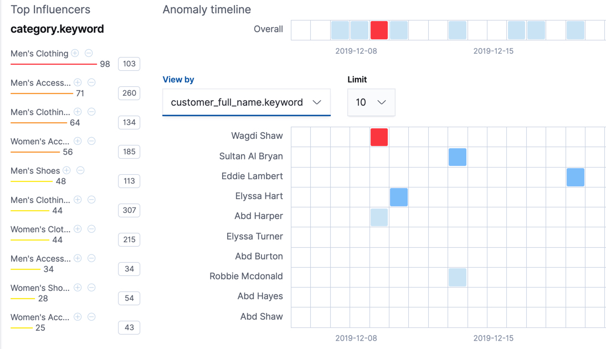

비정상 이벤트가 발생하면 왜 발생했는지 알고싶을 것 입니다.
그러나, 원인을 판단하기 위해 종종 도메인에 대한 광범위한 지식이 필요한 경우가 많습니다.
데이터셋의 어떤 엔터티가 불규칙성을 유발할 수 있는지 의심되는 경우, 해당 엔터티를 이상탐지 잡의 인플루언서로 식별할 수 있습니다.
즉, 인플루언서는 데이터에서 이상치에 대한 영향을 주거나 기여를 한 누구 또는 어떤 것에 대한 정보를 포함할 수 있다고 의심할 수 있는 항목입니다.

데이터의 어떤 필드도 인플루언서가 될 수 있습니다.
그러나 데이터피드를 사용하면 필드는 데이터피드의 쿼리나 집계에 무조건 있어야 합니다.
그렇지 않으면 잡 분석에 포함될 수 없습니다.
데이터피드에 쿼리를 사용하면 추가적인 요구사항이 있습니다.
인플루언서 필드는 디텍터 필드와 동일한 쿼리 결과에 포함되어야 합니다.
데이터피드는 쿼리결과를 페이징하여 데이터를 처리합니다.
검색 적중은 여러 인덱스나 문서에 걸쳐져 있을 수 없으므로 데이터피드는 동일한 제한을 가지게 됩니다.

인풀루언서는 종종 있기는 하지만 이상탐지 잡의 디텍터에 식별된 필드일 필요는 없습니다.
데이터피드에서 집계를 사용하면 디텍터의 필드가 아닌 다른 인덱스에서 가져온 인플루언스를 사용할 수 있습니다.
그러나, 두 인덱스는 데이터피드의 `data_description.time_field` 속성에 정의된 동일한 이름의 날짜 필드를 가지고 있어야 합니다.

인플루언서를 선택하는것은 아래 이유로 강력하게 추천되고 있습니다.

* 이것을 통해 이상에 대한 원인을 더 쉽게 파악할 수 있습니다.
* 결과를 단순화하고 집계합니다.

키바나를 사용하면, 잡 생성 위자드는 인플루언서로 사용할 필드를 제안합니다.
최적의 인플루언서는 이상에 원인이 될 사람이나 물건이 됩니다.
대부분의 경우, 사용자 또는 클라이언트 IP 주소가 최고의 인플루언서가 될 수 있습니다.

:::tip 팁
가장 좋은 사례는 많은 인플루언서를 선택하면 안됩니다.
예로 들어, 일반적으로 3개 이상 필요하지 않습니다.
많은 인플루언서를 선택하면, 결과는 압도적이며 분석에 약간의 오버헤드가 있습니다.
:::

## 인플루언서 결과는 {ml-influencer-results}

인플루언서 결과는 어떤 엔티티가 비정상적이고 언제인지 보여줍니다.
하나의 인플루언서 결과는 버킷의 변칙성에 영향을 준 각 인플루언서에서 버킷마다 작성됩니다.
머신러닝 분석은 특정 인플루언서 값을 가진 모든 데이터 포인트를 제거하고 버킷이 여전히 비정상적인지 확인하는 일련의 실험을 수행하여 인플루언서의 영향도를 결정합니다.
즉, 이상에 대해 통계적으로 의미있는 영향을 미치는 인플루언서만 결과에 보고됩니다.
디텍터가 두개이상 있는 잡의 경우 인플루언서 점수는 가장 비정상적 엔티티에 대한 강력한 뷰를 제공합니다.

예로 들어, 전자상거래 주문 샘플 데이터의 `high_sum_total_sales` 이상탐지 잡은 `customer_full_name.keyword`와 `category.keyword`를 인플루언서로 사용합니다.
[인플루언서 가져오기 API](ml-get-influencer.md)를 사용하여 인플루언서 결과를 확인할 수 있습니다.
대안으로 키바나에서 **Anomaly Explorer**를 사용해도 됩니다.

왼쪽에는 동일한 시간대에 감지된 모든 이상치에 대한 상위 인플루언서 목록이 있습니다.
이 경우 목록은 모든 디텍터에 걸쳐 각 버킷, 각 인플루언서에 대해 집계한 최대 이상점수가 포함됩니다.
또한 각 인플루언서에 대한 이상 점수의 전체합계가 있습니다.
이 목록을 사용하여 기여하는 요인의 범위를 좁히고 가장 비정상적 엔티티에 집중할 수 있습니다.

또한 인플루언서의 값에 해당하는 나열표를 탐색할 수 있습니다.
이번 예제의 나열표는 `customer_full_name.keyword` 의 값에 해당합니다.
기본적으로 나열표는 최대 이상 점수 값을 가진 엔티티에 따라 정렬됩니다.
나열표의 섹션을 클릭하면 그 시간 간격에 발생한 이상치에 대한 상세한 정보를 볼 수 있습니다.

:::tip
**Anomaly Explorer**의 각 섹션에서 보이는 이상점수는 약간 다를 수 있습니다.
이러한 불일치는 각 이상탐지 잡에 대하여 버킷 결과, 인플루언서 결과, 레코드 결과가 있기 때문에 발생합니다.
이상점수는 결과의 각 유형에 대해 생성됩니다.
키바나의 이상 시간대는 버킷수준의 이상점수를 사용합니다.
인플루언서의 나열표를 보려면 인플루언서 수준의 이상점수인 상위 인플루언서 목록을 사용합니다.
이상치 목록은 레코드 수준의 이상점수를 사용합니다.
:::

## 더 알아보기 {futher-reading}

[ML의 해석 가능성 : 이상, 인플루언서, 근본원인의 식별](https://www.elastic.co/blog/interpretability-in-ml-identifying-anomalies-influencers-root-causes)