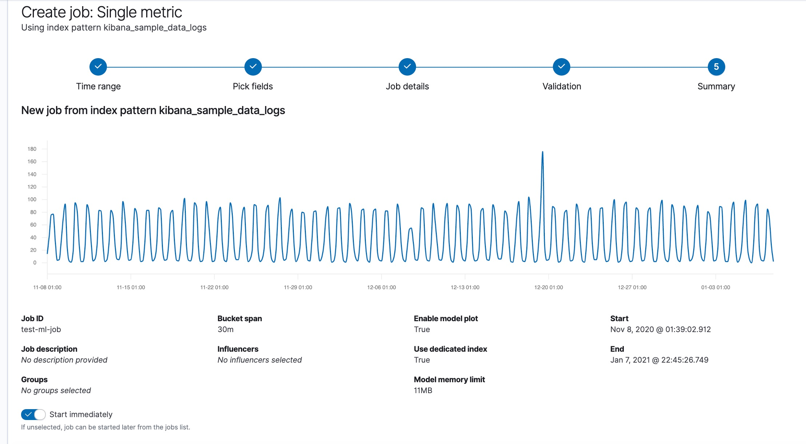

이상탐지 잡은 분석작업을 수행하기 위한 필수적 구성정보와 메타데이터를 포함하고 있습니다.

각각의 이상탐지 잡은 한개 이상의 디텍터를 가지고 있습니다.
디텍터는 데이터의 특정 필드에 분석함수를 적용합니다.
수행할 수 있는 분석 유형에 대해 상세한 정보는 [함수 참조](ml-funtions.md)를 보세요.

또한 비정상으로 간주되는 엔터티나 이벤트의 유형에 영향을 주는 속성이 포함될 수 있습니다.
예로들어, 엔티티가 이전 행동 또는 모집단의 다른 엔티티와 관련되어 분석되는지 지정할 수 있습니다.
데이터를 범주 및 파티션으로 분할하는 여러 옵션도 있습니다.
이러한 고급 작업구성 중 일부는 다음 [예제](anomaly-examples.md) 절에 설명되어있습니다. 

모든 잡 속성에 대한 설명은 [이상탐지 잡 생성 API](ml-put-job.md)를 참고하세요.

키바나에서 단일 메트릭, 다중 메트릭, 모집단 잡 등과 같은 특정유형의 잡을 생성할 수 있도록 도와주는 위자드가 있습니다.
단일 메트릭 잡은 단일 디텍터와 제한된 잡 속성을 가지고 있는 잡입니다.
키바나에서 모든 잡 속성에 접근하려면 고급 잡 위자드를 선택해야합니다.

또한 선택적으로 한개 이상의 잡그룹에 잡을 할당할 수 있습니다.
잡그룹으로 다수의 잡을 좀더 쉽게 결과를 보고 한번에 여러 잡을 열거나 닫는 관리적 작업을 신속하게 처리할 수 있습니다.

<AdsenseB />