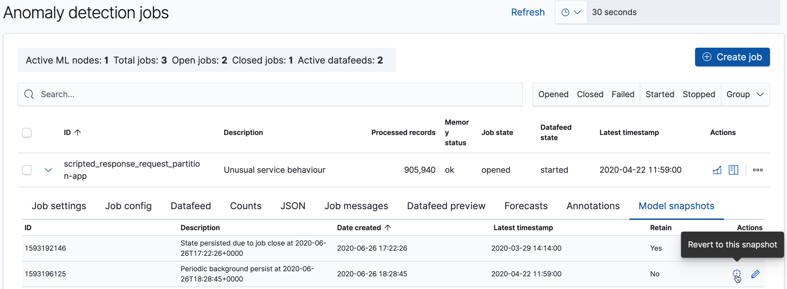

[과거와 현재 분석하기](ml-overview.md#ml-analyzing)에서 언급했듯, 엘라스틱 스택 머신러닝 기능은 일반적인 행동의 기준점을 계산하고 비정상 이벤트를 도출해냅니다.
이 기준점은 데이터에서 모델을 생성하여 수행합니다.

시스템장애 발생시 복구가 가능하도록 이상탐지 작업에 대한 머신러닝 모델의 스냅샷이 엘라스틱서치 클러스터의 내부 인덱스에 저장됩니다.
이러한 스냅샷을 저장하는데 필요한 시간은 메모리에 있는 모델의 크기에 비례합니다.
기본적으로 스냅샷은 약 3 ~ 4시간마다 캡처 됩니다.
잡을 생성 또는 갱신할 때 이 간격(`background_persist_interval`)을 변경할 수 있습니다.

클러스터에서 다수의 스냅샷으로 공간차지를 줄이기 위해 각 날짜의 마지막에 오래된 스냅샷은 자동적으로 삭제합니다.
각 스냅샷의 나이는 가장 최근 스냅샷의 타임스탬프에 연관되어 계산됩니다.
기본적으로, 새로운 스냅샷보다 하루이상 오래된 스냅샷이 있다면 각 날짜의 첫번째 스냅샷을 제외한 나머지를 삭제합니다.
또한 최신 스냅샷보다 10일이 지난 모든 스냅샷은 삭제됩니다.
잡을 생성 또는 갱신할 때 이 보유 설정(`daily_model_snapshot_retention_after_days`와 `model_snapshot_retention_days`)을  변경할 수 있습니다.
정리할 때 특정 스냅샷을 제외하려면 키바나 또는 [모델 스냅샷 갱신 API](ml-update-snapshot.md)를 사용하여 `retain`을 `true`로 변경하면 됩니다.

각 잡에 대한 모델 스냅샷 목록은 [모델 스냅샷 가져오기 API](ml-get-snapshot.md)나 키바나의 **Job Management** 페이지내 **Model snapshots** 탭에서 볼 수 있습니다.

:::tip
시스템 오류 이외의 상황에서 특정 모델 스냅샷을 사용하도록 원복해야할 수 도 있습니다.
머신러닝 기능은 데이터의 비정상적인 입력과 새오룬 동작에 빠르게 반응합니다.
매우 비정상적인 입력은 모델의 변화를 증가시키며 머신러닝 분석은 새로운 단계적 변화인지 일회성 이벤트인지 판단해야합니다.
비정상적인 입력이 일회성인 경우에는 모델 상태를 이벤트 이전의 시간으로 재설정하는 것이 적절할 수 있습니다.
예로 들어, 블랙프라이데이 세일날 이후에는 저장된 스냅샷으로 원복을 고려할 수도 있습니다.
그러나 이러한 이벤트에 대해 미리 알고 있으면 [캘린더와 계획된 이벤트](ml-calendars.md)를 사용하여 모델에 영향을 미치지 않도록 할 수 있습니다.
:::

<AdsenseB />