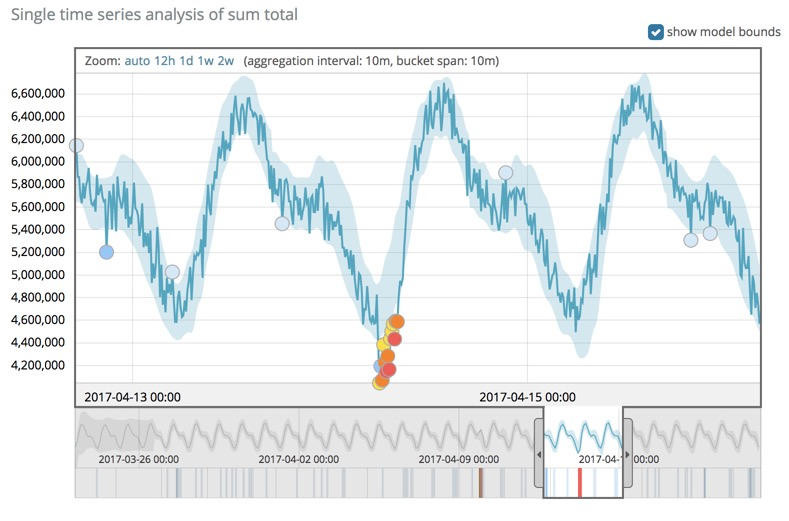
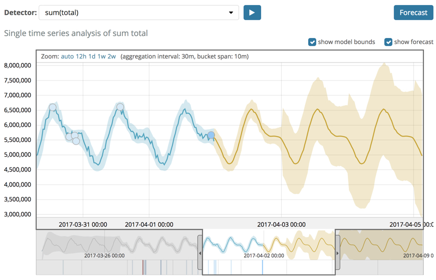

원문 : [https://www.elastic.co/guide/en/machine-learning/7.13/ml-overview.html](https://www.elastic.co/guide/en/machine-learning/7.13/ml-overview.html)

## 과거와 현재 분석하기 {#ml-analyzing}

머신러닝 기능은 시계열 데이터 분석을 자동화하여 데이터에 대한 일반 행동의 정확한 기준점을 생성하고 이상 패턴을 식별합니다.
분석을 위한 데이터는 배치나 실시간 데이터피드로 연속해서 제공할 수 있습니다.

[독점적인 머신러닝 알고리즘](#anomaly-algorithms)을 사용하여 데이터에서 아래의 상황을 감지하고, 점수를 산정하고, 통계적으로 영향이 있는 인플루언서를 연결하게 됩니다.

* 값, 개수 또는 빈도의 시간적 편차와 관련된 이상치
* 통계적 희소성
* 모집단 구성원의 비정상적인 행동들

자동화된 주기적 검출과 데이터 변화에 대한 빠른 적응은 머신러닝의 이점을 얻기위해 알고리즘, 모델, 기타 데이터의 과학관련 구성 등을 지정할 필요하가 없음을 확실하게 해줍니다.

예로, 키바나를 통해 머신러닝의 결과를 볼 수 있으며, 차트는 실제 데이터, 예상값의 범위, 이 범위밖에 발생한 이상치들을 표현하고 있습니다.

## 미래 예측하기 {#ml-forecasting}

머신러닝 기능을 가지고 데이터의 일반적인 행동에 대한 기준점을 생성한 뒤, 이 정보를 활용해서 미래 행동을 추정할 수 있습니다.

특정 미래 일자의 시계열 값을 추정하기 위해 예측을 사용할 수 있습니다.
예로 들어, 다음 일요일 9시에 웹사이트에 얼마나 많은 사용자가 방문할 예정인지 결정할 수 있습니다.

또한 미래 일자에 발샐할 시계열 값에 대한 확률을 계산하기 위해 사용할 수 있습니다.
예로 들어, 다음 주말까지 디스크 사용률이 100%에 도달할 가능성을 확인하려고 할 수 있습니다.

각 예측에는 고유한 ID가 있어 다른 시간에 생성한 예측을 구별하는 데 사용할 수 있습니다.
예측 이상감지 잡 API나 키바나를 사용해서 예측을 생성할 수 있습니다.
예로 들면,

차트의 노란색 선은 예측된 데이터 값을 나타냅니다.
음영 처리된 노란색 영역은 예측된 값의 경계를 나타내며 예측의 신뢰도를 나타냅니다.

예측을 생성할 때 예측이 처리된 마지막 레코드를 넘어 확장되는 정도를 나타내는 기간을 지정합니다.
기본적으로 기간은 1일 입니다.
일반적으로 예측하는 미래가 멀수록 신뢰 수준이 점점 낮아집니다. (즉, 범위가 증가함)
결국 신뢰 수준이 너무 낮으면 예측이 중지됩니다.
예측 생성 기능에 영향을 미치는 제한 사항에 대한 자세한 내용은 [지원되지 않는 예측 구성](./ml-limitations#ml-forecast-config-limitations)을 참고하세요.

## 이상탐지 알고리즘 {#anomaly-algorithms}

이상탐지 머신러닝 기능은 클러스터링, 다양한 유형의 시계열 분해, 베이지안 분포 모델링 및 상관 분석 등과 같은 다양한 기술의 맞춤형 융합을 사용합니다.
이 분석들은 시계열 데이터에 대해 정교한 실시간 자동화된 이상탐지를 제공합니다.

머신러닝은 과거 동작을 관찰하고 새로운 데이터에 적응하여 데이터의 시간기반 특성을 통계적으로 모델분석합니다.
모델은 정상적인 행동의 기준선을 나타내므로 새로운 이벤트가 얼마나 변칙적인지를 결정하는 데 사용할 수 있습니다.

각 [버킷 범위](ml-buckets.md)별 이상탐지 결과가 기록됩니다.
이러한 결과에는 노이즈를 줄이기 위해 집계된 점수와 수학적으로 가장 중요한 이상치에 순위를 매기기 위한 정규화된 점수가 포함됩니다.
더 자세한 내용은 [버킷 결과](ml-buckets.md#ml-bucket-results)와 [인플루언서 결과](ml-influencers.md#ml-influencer-results)를 참고하세요.

<AdsenseB />