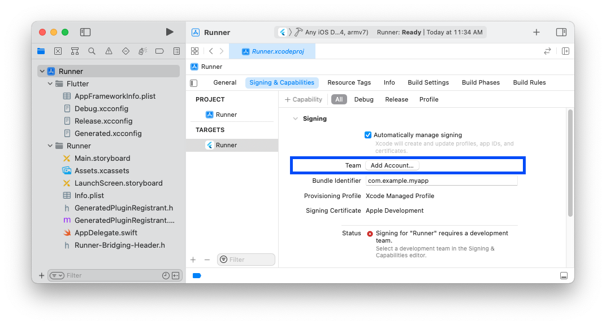
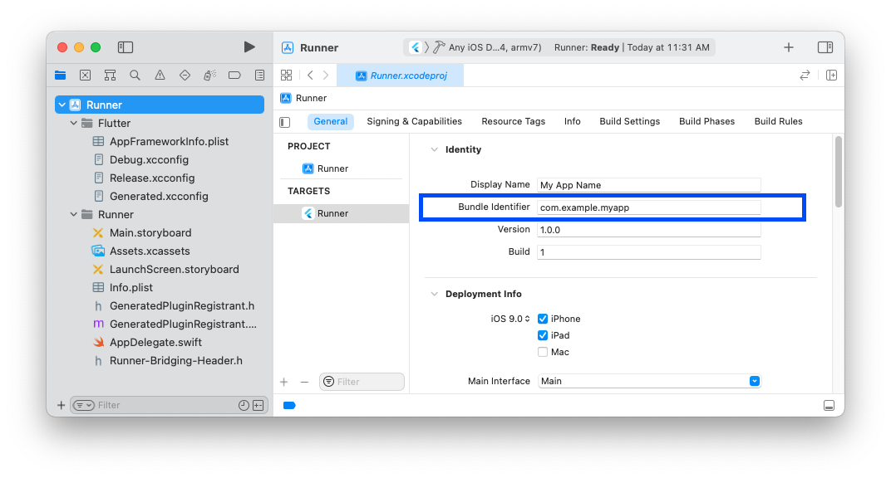

원문 : [https://docs.flutter.dev/get-started/install/macos](https://docs.flutter.dev/get-started/install/macos)

## 시스템 요구사항

Flutter를 설치하고 실행하기 위해 아래의 최소 요구사항을 가진 개발환경이 필요합니다.

* **운영체제** : macOS
* **디스크 공간** : 2.8 GB (IDE/도구를 포함하지 않습니다)
* **도구** : Flutter는 설치 및 업그레이드에 `git`을 사용합니다. `git`을 포함하여 [Xcode](https://developer.apple.com/xcode/)를 설치하길 권장합니다.
  또는 별도로 [git 설치](https://git-scm.com/download/mac)를 진행해도 됩니다.

::: warning 중요
[애플 실리콘 맥](https://support.apple.com/en-us/HT211814)에 설치할 경우, [일부 보조도구](https://github.com/flutter/website/pull/7119#issuecomment-1124537969)를 위한 Rosetta 전환 환경이 가능해야 합니다.
다음을 실행해서 수동으로 설치할 수 있습니다.

```bash
$ sudo softwareupdate --install-rosetta --agree-to-license
```
:::

## Flutter SDK 가져오기

1. Flutter SDK의 마지막 안정 릴리즈를 다운받기 위해 아래의 설치번들을 다운로드 하세요.
  
    * **인텔** [flutter_macos_3.0.5-stable.zip](https://storage.googleapis.com/flutter_infra_release/releases/stable/macos/flutter_macos_3.0.5-stable.zip)

    * **애플 실리콘** [flutter_macos_arm64_3.0.5-stable.zip](https://storage.googleapis.com/flutter_infra_release/releases/stable/macos/flutter_macos_arm64_3.0.5-stable.zip)
  
    다른 릴리즈나 오래된 빌드버전은 [SDK releases](https://docs.flutter.dev/development/tools/sdk/releases) 페이지를 참고하세요.

    :::tip
    애플 실리콘 프로세서를 사용하는 맥인지 확인하기 위해 apple.com의 [애플 싪리콘 맥 컴퓨터](https://support.apple.com/en-us/HT211814)를 참고하세요.
    :::
2. 다음과 같이 원하는 위치에 파일을 압축해지 합니다.

    ```bash
    $ cd ~/development
    $ unzip ~/Downloads/flutter_macos_3.0.5-stable.zip
    ```
3. `flutter` 도구를 환경경로에 추가합니다.

    ```bash
    $ export PATH="$PATH:`pwd`/flutter/bin"
    ```

    이 명령은 현재의 터미널 윈도우에서만 `PATH` 변수를 설정합니다.
    영구적으로 환경변수에 Flutter를 추가하려면 [환경경로 갱신하기](#환경경로-갱신하기)를 참고하세요.

이제 Flutter 명령을 실행할 준비가 되었습니다.

::: tip
기존 Flutter의 버전을 업그레이드 할 경우 [Flutter 업그레이드](https://docs.flutter.dev/development/tools/sdk/upgrading)를 참고하세요.
:::

### `flutter doctor` 실행하기

모든 설정을 완료하기위해 설치가 필요한 다른 의존성이 있는지 확인하기 위해 아래 명령을 실행하시면 됩니다. (상세정보 출력은 `-v` 플래그를 추가하세요)

```bash
$ flutter doctor
```

이 명령은 환경을 검증하고 터미널윈도우에 보고서를 출력해줍니다.
Dart SDK는 Flutter의 번들로 포함되어있습니다.
따로 Dart를 별도로 설치할 필요는 없습니다.
다른 소프트웨어를 설치해야하거나 수행할 작업들이 있을 수 있으니 출력된 내용을 주의깊게 살펴보시기 바랍니다. (**굵은글씨**로 표시됩니다)

예는 다음과 같습니다.

``` {3}
[-] Android toolchain - develop for Android devices
    • Android SDK at /Users/obiwan/Library/Android/sdk
    ✗ Android SDK is missing command line tools; download from https://goo.gl/XxQghQ
    • Try re-installing or updating your Android SDK,
      visit https://docs.flutter.dev/setup/#android-setup for detailed instructions.
```

아래 절은 이러한 행동을 어떻게 수행하고 설치과정을 마무리하는지 보여줍니다.

누락된 의존성을 설치한 뒤 다시 `flutter doctor` 명령을 수행하면 모든 것이 정상적으로 되어있는지 검증할 수 있습니다.

### 아카이브 외에 Github에서 직접 다운로드하기

_고급 사용사례에서만 권장됩니다_

준비된 아카이브를 다운로드하지 않고 직접 git을 사용할 수 있습니다.
예로들어, 안정브랜치에서 다운로드 하려면 다음과 같습니다.

```bash
$ git clone https://github.com/flutter/flutter.git -b stable
```

[환경경로를 갱신하고](#환경경로-갱신하기) `flutter doctor`를 실행합니다.
Flutter를 사용하기 위해 설치가 필요한 다른 의존성을 확인할 수 있습니다. (예, Android SDK)

아카이브를 사용하지 않으면 Flutter는 필요한 개발 바이너리를 다운받을 수도 있습니다. (아카이브 사용시 포함됨)
개발 바이너리가 사전에 다운되어야 하는 경우도 있을 것 입니다. (예를들어, 폐쇄형 빌드환경, 간헐적 네트워크 가용성이 보장된 경우 이작업이 필요할 것 입니다)
아래의 명령으로 가능합니다.

```bash
$ flutter precache
```

추가적인 다운로드 옵션은 `flutter help precache` 명령으로 확인하세요.

::: warning
Flutter 도구는 가끔 구글서버로부터 리소스를 다운받습니다.
Flutter SDK를 다운받거나 사용하기 위해서는 [Google Terms of Service](https://policies.google.com/terms)에 동의해야합니다.

예로들어, Github를 사용하여 설치한 경우(미리 패키징된 아카이브와는 달리), Flutter 도구는 최초실행시 Dart SDK를 구글서버로부터 다운받아 `flutter` 도구 자체를 실행할때 사용합니다.
이것은 Flutter를 업그레이드 할때도 동일하게 발생합니다.(예로, `flutter upgrade` 명령어를 실행한 경우)

`flutter` 도구는 기능 사용 통계를 보고하거나 [충돌보고서](https://github.com/flutter/flutter/wiki/Flutter-CLI-crash-reporting)를 전송하기 위해 Google Analytics를 사용합니다.

Flutter 도구 분석은 최초실행시 전송되지는 않습니다.
보고서를 비활성화하려면, `flutter config --no-analytics`를 실행하시면 됩니다.
현재 설정정보를 보려면, `flutter config`를 사용하시면 됩니다.
만약 분석 설정을 미사용하게 되면, opt-out(옵션 미사용) 이벤트가 전송되고 이후에는 Flutter 도구를 통해 전송되는 정보는 없습니다.

또한 Dart 도구는 사용량 매트릭스 및 충돌보고서를 구글에 전송합니다.
이런 매트릭스의 제출을 제어하려면, [`dart tool`](https://dart.dev/tools/dart-tool)에 아래 옵션을 사용하시면 됩니다.

* `--enable-analytics` : 익명분석 활성화
* `--disable-analytics` : 익명분석 비활성화

[구글 개인정보보호 정책](https://policies.google.com/privacy)에 이러한 서비스에서 데이터를 어떻게 처리하는지 안내되어있습니다.
:::

### 환경경로 갱신하기

[Flutter SDK 가져오기](#flutter-sdk-가져오기)에서 보셨듯 명령줄에서 현재 세션의 PATH 변수를 갱신할 수 있습니다.
영구적으로 변수를 갱신할 경우 어떤 터미널 세션이던 `flutter` 명령을 실행할 수 있습니다.

모든 터미널 세션에서 변수를 영구적으로 수정하는 단계는 시스템마다 상이합니다.
일반적으로 새로운 윈도우가 실행될 때 수행되는 파일에 줄을 추가하는 것 입니다.
예로들면,

1. Flutter SDK 복제본의 경로를 결정합니다. 이것은 단계 3에 필요합니다.
2. 쉘의 `rc` 파일을 엽니다(또는 생성). 
    터미널에서 `echo $SHELL`을 입력하면 사용하는 쉘이 어떤 것인지 알려줍니다.
    만약 Bash를 사용하고 있으면 `$HOME/.bash_profile` 또는 `$HOME/.bashrc`를 수정합니다.
    Z 쉘을 사용할 경우 `$HOME/.zshrc`를 수정합니다.
    다른 쉘을 사용할 경우에는 장치마다 파일 경로 및 이름이 다를 것 입니다.
3. 아래의 줄을 추가하고 `[PATH_OF_FLUTTER_GIT_DIRECTORY]`를 Flutter 깃 저장소의 복제본 경로로 변경하면 됩니다.
  
    ```bash
    $ export PATH="$PATH:[PATH_OF_FLUTTER_GIT_DIRECTORY]/bin"
    ```
4. 현재 윈도우에서 `source $HOME/.<rc file>`을 실행하여 갱신하거나, 소스 파일이 자동으로 적용되도록 새로운 터미널 윈도우를 엽니다.
5. 다음을 실행해서 PATH에 `flutter/bin` 디렉터리가 있는지 확인합니다.
  
    ```bash
    $ echo $PATH
    ```
    
    다음을 실행해서 flutter 명령이 가능한지 확인합니다.

    ```bash
    $ which flutter
    ```

## 플랫폼 설정

macOS는 iOS, Android, 웹에서 Flutter 앱을 개발할 수 있게 지원합니다.
첫번째 Flutter 앱을 빌드하고 실행하기 위하여 적어도 1개의 플랫폼 설정을 지금 완료하시기 바랍니다.

## iOS 설정

### Xcode 설치하기

iOS용 Flutter 앱을 개발하려면 Xcode가 설치된 Mac이 필요합니다.

1. 최신 안정화 버전의 Xcode를 설치합니다. ([웹 다운로드](https://developer.apple.com/xcode/) 또는 [Mac 앱스토어](https://itunes.apple.com/us/app/xcode/id497799835)를 사용)
2. 명령줄에서 아래를 실행하여 새로 설치된 버전의 Xcode를 사용하기 위해 Xcode 명령줄 도구를 구성합니다.

    ```bash
    $ sudo xcode-select --switch /Applications/Xcode.app/Contents/Developer
    $ sudo xcodebuild -runFirstLaunch
    ```

    Xcode의 마지막 버전을 사용하고 있다면 대부분의 경우 위 경로가 맞을 것 입니다.
    만약 다른 버전을 사용하고 있다면 그것에 맞게 경로를 변경하면 됩니다.
3. Xcode 라이선스 동의를 하기 위하여 Xcode를 한번 실행한뒤 동의하거나 명령줄에서 `sudo xcodebuild -license`를 실행합니다.

마지막 안정버전보다 오래된 버전을 사용해도 무방하나 Flutter 개발에는 권장드리지 않습니다.
오래된 버전의 Xcode를 비트코드로 지정하여 사용하는 것이 지원되지 않거나 동작하지 않을 수 있습니다.

Xcode가 설치되면 iOS 장치나 시뮬레이터로 Flutter 앱을 실행할 수 있습니다.

### iOS 시뮬레이터 설정하기

iOS 시뮬레이터로 Flutter 앱을 실행하고 테스트하려면 다음 단계를 따르세요.

1. Mac에서 Spotlight 또는 아래 명령으로 Simulator를 찾습니다.

    ```bash
    $ open -a Simulator
    ```
2. 시뮬레이터가 64비트 장치(iPhone 5s 이후)를 사용하는지 확인하세요.
    시뮬레이터의 **Hardware > Device**나 **File > Open Simulator** 메뉴에서 장치의 설정을 확인할 수 있습니다.
3. 개발하는 장비의 화면사이즈에 따라 시뮬레이팅된 고해상도 iOS 장치가 화면을 넘어갈 수 있습니다.
    시뮬레이터의 가장자리를 잡고 드래그하여 비율을 조정할 수 있습니다.
    또한 화면이 충분히 크다면 **Window > Physical Size** 또는 **Window > Pixel Accurate** 옵션을 사용할 수 있습니다.
    * Xcode 9.1 보다 오래된 버전을 사용한다면 **Window > Scale** 메뉴에서 device scale을 설정해야 합니다.

### 단순 Flutter 앱 생성 및 실행하기

구성된 것에 Flutter 앱을 생성하고 테스트 하려면 다음 단계를 따르세요.

1. 명령줄에서 아래 명령을 실행하여 Flutter 앱을 생성합니다.

    ```bash
    $ flutter create my_app
    ```
2. `my_app` 디렉터리가 생성되며 Flutter 시작 앱을 포함하고 있습니다. 해당 디렉터리로 이동합니다.

    ```bash
    $ cd my_app
    ```
3. 시뮬레이터에서 앱을 시작하기위해 시뮬레이터를 실행하고 다음을 입력합니다.

    ```bash
    $ flutter run
    ```

### iOS 장치에 배포하기

Flutter 앱을 실제 iOS 장치에 배포하려면 Xcode에서 물리장치배포와 애플 개발자 계정을 구성해야합니다.
앱이 Flutter 플러그인을 사용한다면 CocoaPods 3자의존성관리자가 필요합니다.

1. 앱이 네이티브 iOS코드와 [Flutter 플러그인](https://docs.flutter.dev/development/packages-and-plugins/developing-packages#types)에 의존적이지 않다면 생략해도 됩니다.
    아래 명령을 실행해서 [CocoaPods 설치 및 구성](https://guides.cocoapods.org/using/getting-started.html#installation)합니다.

    ```bash
    $ sudo gem install cocoapods
    ```

    ::: tip
    Ruby의 기본버전은 CocoaPods 젬을 설치하기 위해 `sudo`를 요구합니다.
    만약 Ruby 버전관리자를 사용한다면 `sudo`없이 실행 할 수 있습니다.

    추가로, [애플 실리콘 맥](https://support.apple.com/en-us/HT211814)에서 설치를 진행한다면, 다음 명령를 실행하세요.
    ```bash
    $ sudo gem uninstall ffi && sudo gem install ffi -- --enable-libffi-alloc
    ```
    :::
2. Xcode 서명 흐름을 따라 프로젝트를 프로비저닝합니다.
    1. Flutter 프로젝트 디렉터리에서 터미널 윈도우를 열고 `open ios/Runner .xcworkspace`를 실행하여 프로젝트의 Xcode 워크스페이스를 엽니다.
    2. run 버튼 옆에 있는 device 드롭다운메뉴에서 배포하려는 장치를 선택합니다.
    3. 왼쪽 탐색패널에서 `Runner` 프로젝트를 선택합니다.
    4. `Runner` 대상 설정페이지의 **Signing & Capabilities > Team** 아래에 개발팀이 선택되어있는지 확인합니다.
    팀을 선택하면 Xcode는 개발인증서를 생성하고 다운받고, 계정에 장치를 등록하고 (필요시) 프로비저닝 프로파일을 생성 및 다운받습니다.
        * 최초 iOS 개발프로젝트를 시작하려면 Xcode에 애플ID로 로그인해야합니다.
        개발 및 테스트는 어떤 애플ID던 지원합니다.
        애플 개발자 프로그램에 등록하는 것은 앱스토어에 앱을 배포할 때 필요로 합니다.
        자세한 멤버쉽유형은 [멤버쉽 선택하기](https://developer.apple.com/support/compare-memberships)를 참고하세요.

            

        * iOS 개발에 연결된 물리장치를 처음 사용할때 장치에서 Mac과 개발인증을 신뢰해야합니다.
        iOS 장치에서 Mac으로 처음 접속할 때 팝업에서 `Trust`를 선택합니다.
        그리고나서 iOS 장치에서 설정 앱으로 이동한뒤 **General > Device Management**를 선택하고 인증을 신뢰합니다.
        최초 사용자의 경우 **General > Profiles > Device Management**를 대신 선택해야합니다.

            

                
        * Xcode에서 자동 서명이 실패할 경우 프로젝트의 **General > Identity > Bundle Identifier**가 유니크한지 확인하시기 바랍니다.

            
3. `flutter run`을 실행하거나 Xcode에서 Run 버튼을 클릭하여 앱을 시작합니다.
        

## Android 설정

::: tip
Flutter는 Android 플랫폼 의존성을 지원하기 위해 Android Studio를 전체설치하도록 되어있습니다.
그러나 다양한 에디터에서 Flutter 어플리케이션을 작성할 수 있으며, 뒤에서 다루도록 하겠습니다.
:::

### Android Studio 설치하기

1. [Android Studio](https://developer.android.com/studio)를 다운받고 설치합니다.
2. Android Studio를 시작하고 'Android Studio Setup Wizard'로 이동합니다.
	Flutter에서 Android를 개발할 때 필요한 가장 최신의 Android SDK, Android SDK 명령줄 도구, Android SDK 빌드도구를 설치합니다.
3. `flutter doctor`를 실행해서 Android Studio 설치가 맞게 되었는지 검증합니다.
    만약 Flutter에서 없다고 표시하면, Android Studio가 설치된 디렉터리를 `flutter config --android-studio-dir <directory>` 명령으로 설정합니다.

### Android 장치 설정하기

Android 장치에서 Flutter 어플리케이션을 실행하고 테스트할 준비를 위해 Android 4.1 (API level 16) 또는 그 이상이 실행되는 Android 장치가 필요합니다.

1. 장치에서 **개발자 옵션**과 **USB 디버깅**을 활성화 합니다.
    자세한 방법은 [Android 문서](https://developer.android.com/studio/debug/dev-options)를 참고하시면 됩니다.
2. Windows일 경우 : [Google USB Driver](https://developer.android.com/studio/run/win-usb)를 설치합니다.
3. USB 케이블을 사용해서 컴퓨터에 핸드폰을 연결합니다.
    장치에 확인창이 표시되면 컴퓨터에서 장치접근을 할 수 있도록 권한을 허용합니다.
4. 터미널에서 `flutter devices` 명령을 실행하여 Flutter가 연결된 Android 장치를 인식하고 있는지 검증합니다.
    기본적으로 `abd` 도구에 기반한 Android SDK 버전을 사용합니다.
    Flutter에서 다른 버전의 Android SDK를 사용하고 싶을 경우 `ANDROID_SDK_ROOT` 환경변수를 해당 SDK가 설치된 경로로 변경설정해야합니다.

### Android 에뮬레이터 설정하기

Android 에뮬레이터에서 Flutter 어플리케이션을 실행하고 테스트하기 위해서 다음 동작을 따라하세요.

1. 장치에서 [VM 가속화](https://developer.android.com/studio/run/emulator-acceleration)를 활성화 합니다.
2. **Android Studio**를 실행하고 **AVD Manager** 아이콘을 클릭한 뒤 **Create Virtual Device...** 을 선택합니다.
    * 오래된 Android Studio의 경우 **Android Studio > 도구 > Android > AVD Manager**를 실행하고 **Create Virtual Device...** 를 선택합니다.
    (**Android** 하위 메뉴는 Android 프로젝트 내에서만 표출됩니다)
    * 프로젝트를 열고 있지 않는다면 **Configure > AVD Manager**를 선택하고 **Create Virtual Device...** 를 선택합니다.
3. 장치 정의를 선택하고 **Next**를 클릭합니다.
4. 에뮬레이팅할 Android 버전의 시스템 이미지 1개 이상을 선택하고 **Next**를 클릭합니다.
    x86 또는 x86_64 이미지를 추천합니다.
5. Emulated Performance 아래 **Hardware - GLES 2.0**을 선택하여 [장치 가속화](https://developer.android.com/studio/run/emulator-acceleration)를 활성화 합니다.
6. AVD 구성이 정확한지 검증하고 **Finish**를 클릭합니다.

    위의 자세한 단계는 [AVD 관리하기](https://developer.android.com/studio/run/managing-avds)를 참고하시면 됩니다.
7. Android 가상장치 관리자에서 툴바의 **Run**을 클릭합니다.
    에뮬레이터가 시작되고 선택한 OS 버전 및 장치에 대한 기본 화면이 표시됩니다.

### Android 라이선스 동의하기

Flutter를 사용하기 전에 Android SDK 플랫폼 라이선스를 동의해야 합니다.
이 과정은 아래 나열된 도구가 설치된 후 완료되면 됩니다.

1. 설치된 자바의 버전이 8인지 확인하고 `JAVA_HOME` 환경변수에 JDK 폴더가 설정되었는지 확인합니다.

    Android Studio 2.2 또는 그 이상의 버전에는 JDK가 포함되어 따로 하실일은 없습니다.
2. 열려진 콘솔 윈도우에서 라이선스 동의를 시작하기 위해 아래 명령을 실행합니다.

    ```bash
    $ flutter doctor --android-licenses
    ```
3. 동의하기전에 각각의 라이선스 규약을 확인해보시기 바랍니다.
4. 라이선스에 동의한 경우 `flutter doctor`를 다시 실행하여 Flutter를 사용할 준비가 완료되었는지 확인합니다.

## macOS 설정

### 추가적인 macOS 요구사항

macOS 데스크톱 개발을 위해 Flutter SDK 외에 추가로 아래의 내용이 필요합니다.

* [Xcode](https://developer.apple.com/xcode/)
* 플러그인을 사용한다면 [CocoaPods](https://cocoapods.org/)

## 웹 설정

Flutter는 `stable`채널에서 웹 어플리케이션 빌드를 지원합니다.
Flutter 2에서 다른 어플리케이션을 만들면 자동으로 웹으로 빌드가 됩니다.
웹이 안정화되기 전에 생성된 어플리케이션에서 웹을 지원하도록 하려면 위에 설정을 모두 마친 뒤 [Flutter에서 웹 어플리케이션 빌드하기](../web.md) 지침을 따라하시면 됩니다.

## 다음단계

선호하는 에디터를 구성하시면 됩니다.

<AdsenseB />