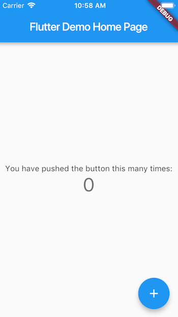

원문 : [https://docs.flutter.dev/get-started/test-drive?tab=vscode](https://docs.flutter.dev/get-started/test-drive?tab=vscode)

## 앱 생성하기

1. **View > Command Palette** 를 실행합니다.
2. "flutter"를 입력하고 **Flutter: New Project** 를 선택합니다.
3. **Application** 을 선택합니다.
4. 새로운 프로젝트 폴더를 위해 상위 디렉터리를 생성하거나 선택합니다.
5. `myapp`와 같은 프로젝트 이름을 입력하고 **엔터** 를 입력합니다.
6. 프로젝트 생성이 완료될때까지 대기한 뒤 `main.dart`가 보일 것 입니다.

위 명령은 `myapp`이라는 Flutter 프로젝트 디렉터리를 생성하며 [매터리얼 컴포넌트(Material Components)](https://material.io/guidelines)를 사용한 간단한 데모 앱을 포함하고 있습니다.

:::tip 노트
새로운 Flutter 앱을 생성할 때 일부 Flutter IDE 플러그인이 `com.example`와 같은 역순의 회사 도메인 이름을 물어봅니다.
회사 도메인 이름과 프로젝트 이름이 앱을 릴리즈할 때 Android용의 패키지 이름으로 사용됩니다.
만약 앱을 릴리즈할 생각이 있다면 패키지 이름을 지금 잘 정해야 합니다.
패키지 이름은 앱이 릴리즈 되면 변경되지 않으며 이것은 유니크하게 만들어야합니다.
:::

:::warning
Flutter를 초기구성하고 있을 때 VS Code가 실행중이라면 아마 VS Code의 Flutter 플러그인이 Flutter SDK를 인식하기 위해 재시작해야할 수 있습니다.
:::

:::tip
앱의 코드는 `lib/main.dart`에 있습니다.
각각 코드 블럭에 대한 상세한 설명은 파일의 최상단에 있는 주석을 참고하시면 됩니다.
:::

## 앱 실행하기

1. VS Code 상태표시줄을 확인합니다. (윈도우창 하단의 파란색 바)
    
2. **Device Selector** 영역에서 장치를 선택합니다.
    자세한 내용은 [Flutter 장치 빠르게 전환하기](https://dartcode.org/docs/quickly-switching-between-flutter-devices/)를 참고하세요.
    * 가능한 장치가 없고 장치시뮬레이터를 사용하려면, **No Devices** 를 클릭하고 시뮬레이터를 기동합니다.
        :::warning
        VS Code 에서 **No Devices** 를 클릭했는데 **Start iOS Simulator** 가 없을 수 있습니다.
        Mac에서 작업중이라면 아래의 명령을 터미널에서 실행하여 시뮬레이터를 기동합니다.
        ```bash
        open -a simulator
        ```
        윈도우나 리눅스에서는 iOS 시뮬레이터를 기동할 수 없습니다.
        :::
    * 실제 장치를 설정할 경우, [설치하기](../install)에서 OS에 맞는 장치특화 지침을 따라하시기 바랍니다.
3. **Run > Start Debugging** 을 실행하거나, **F5** 를 누릅니다.
4. 앱이 기동될때까지 대기합니다. **Debug Console** 뷰에서 처리과정이 출력됩니다.

앱 빌드가 완료되면 장치에서 스타터 앱을 볼 수 있습니다.



## 핫리로드 해보기

Flutter는 빠른 개발 사이클을 제공하기 위하여 _스테이트풀 핫 리로드_를 제공합니다.
수행중인 앱을 따로 재시작하지 않고 상태값도 유실되지 않은 채로 코드를 다시불러올 수 있게 합니다.
앱 소스를 변경하고 IDE나 명령줄 도구에 핫 리로드를 원한다고 처리하면 시뮬레이터/에뮬레이터/장치에서 변경된 내용을 볼 수 있습니다.

1. `lib/main.dart` 파일을 엽니다.
2. 문자열을 아래와 같이 변경합니다.
    ```
    변경전 : 'You have pushed the button this many times'
    ```
    ```
    변경후 : 'You have clicked the button this many times'
    ```
    :::warning
    앱을 중단하지 않습니다.
    실행중 그대로 유지하시면 됩니다.
    :::
3. 변경내용을 저장합니다.
    ***Save All***을 실행하거나, ***Hot Reload***를 클릭합니다.

실행중인 앱에서 거의바로 갱신된 문자열을 볼 수 있습니다.

## 프로파일 또는 릴리즈 실행

:::warning 중요
디버그 모드나 핫리로드가 활성화 되어있을때는 앱에대한 성능을 테스트하지 마세요.
:::

아마도 디버그 모드로 앱을 실행하고 있을 것 입니다.
디버그 모드는 성능대신 핫리로드, 단계적 디버깅 등과 같은 개발에 유용한 기능을 추가한 것 입니다.
디버그 모드에서는 느린 성능이나 버벅거리는 애니메이션이 발생할 수 있습니다.
성능을 분석하거나 앱을 릴리즈할 때가 오면, Flutter의 "프로파일", "릴리즈" 빌드모드를 사용하면 됩니다.
자세한 정보는 [Flutter의 빌드모드](https://docs.flutter.dev/testing/build-modes)를 참고하시기 바랍니다.

:::warning 중요
앱에 대한 패키지 크기에 고민이라면, [앱 크기 측정](https://docs.flutter.dev/perf/app-size)을 참고하세요.
:::

<AdsenseB />