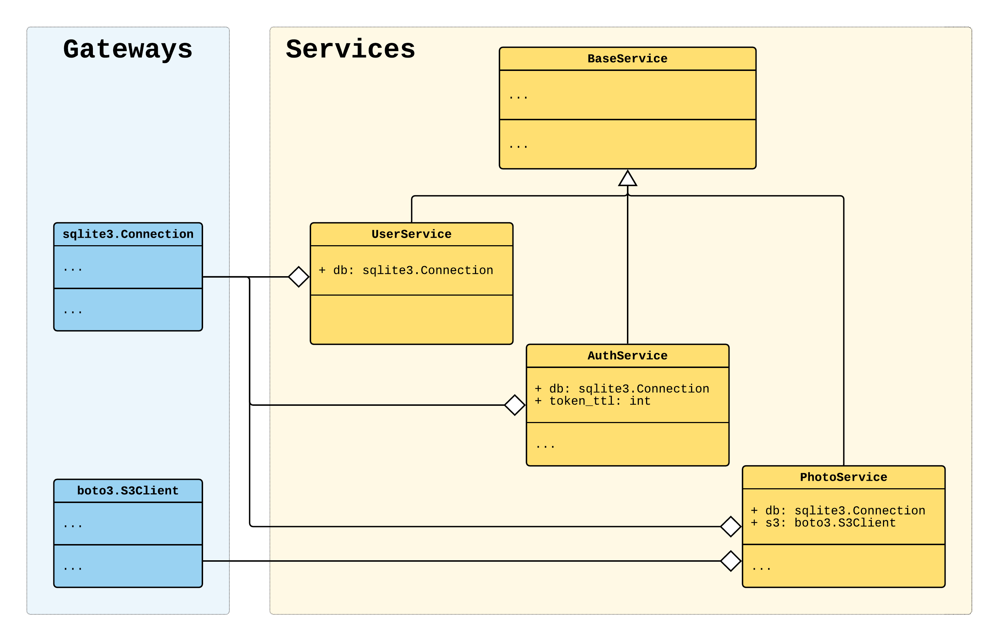

원문 : [https://python-dependency-injector.ets-labs.org/examples/application-single-container.html](https://python-dependency-injector.ets-labs.org/examples/application-single-container.html)

이 예제는 단일 선언적 컨테이너를 사용한 어플리케이션을 어떻게 생성하는지 보여줍니다.
단일 선언적 컨테이너를 사용하는 것은 작거나 보통의 규모 어플리케이션에 좋은 선택입니다.
대규모의 어플리케이션 구성을 위하면 [어플리케이션 예제 (다중 컨테이너)](./multi_containers.md)를 참고하세요.

아래의 의존성 주입 원칙을 따르는 작은 어플리케이션 예제를 만들어보겠습니다.
도메인 로직을 가지는 다수의 서비스로 구성되어있습니다.
서비스는 데이터베이스와 AWS S3에 의존성을 가지고 있습니다.



소스코드와 실행방법은 [깃허브](https://github.com/ets-labs/python-dependency-injector/tree/master/examples/miniapps/application-single-container)에서 찾을 수 있습니다.

## 어플리케이션 구조

어플리케이션은 `example` 패키지와 다수의 설정 파일, `requirements.txt` 파일로 이뤄져 있습니다.

```
./
├── example/
│   ├── __init__.py
│   ├── __main__.py
│   ├── containers.py
│   └── services.py
├── config.ini
├── logging.ini
└── requirements.txt
```

## 컨테이너

`example/containers.py`의 내용입니다.

```python
"""Containers module."""

import logging.config
import sqlite3

import boto3
from dependency_injector import containers, providers

from . import services


class Container(containers.DeclarativeContainer):
    # 구성정보 로딩
    config = providers.Configuration(ini_files=["config.ini"])

    # 로깅정보 설정
    logging = providers.Resource(
        logging.config.fileConfig,
        fname="logging.ini",
    )

    # 데이터베이스 클라이언트를 싱글톤으로 구성
    database_client = providers.Singleton(
        sqlite3.connect,
        config.database.dsn,
    )

    # S3 클라이언트를 싱글톤으로 구성
    s3_client = providers.Singleton(
        boto3.client,
        service_name="s3",
        aws_access_key_id=config.aws.access_key_id,
        aws_secret_access_key=config.aws.secret_access_key,
    )

    # 각 서비스에 대한 의존성, 속성을 주입하고, Factory(요청시 객체생성)으로 구성
    user_service = providers.Factory(
        services.UserService,
        db=database_client,
    )

    auth_service = providers.Factory(
        services.AuthService,
        db=database_client,
        token_ttl=config.auth.token_ttl.as_int(),
    )

    photo_service = providers.Factory(
        services.PhotoService,
        db=database_client,
        s3=s3_client,
    )
```

## 메인 모듈

`example/__main__.py`의 내용입니다.

```python
"""Main module."""

import sys

from dependency_injector.wiring import Provide, inject

from .services import UserService, AuthService, PhotoService
from .containers import Container

# 의존성을 주입
@inject
def main(
        email: str,
        password: str,
        photo: str,
        user_service: UserService = Provide[Container.user_service],
        auth_service: AuthService = Provide[Container.auth_service],
        photo_service: PhotoService = Provide[Container.photo_service],
) -> None:
    user = user_service.get_user(email)
    auth_service.authenticate(user, password)
    photo_service.upload_photo(user, photo)


if __name__ == "__main__":
    # 컨테이너를 생성
    container = Container()
    container.init_resources()
    # 현재 파일을 컨테이너에 연결
    container.wire(modules=[__name__])

    main(*sys.argv[1:])
```

## 서비스

`example/services.py`의 내용입니다.

```python
"""Services module."""

import logging
import sqlite3
from typing import Dict

from mypy_boto3_s3 import S3Client


class BaseService:

    def __init__(self) -> None:
        self.logger = logging.getLogger(
            f"{__name__}.{self.__class__.__name__}",
        )


class UserService(BaseService):
    # db에 Container에서 정의한 의존성이 주입됨
    def __init__(self, db: sqlite3.Connection) -> None:
        self.db = db
        super().__init__()

    def get_user(self, email: str) -> Dict[str, str]:
        self.logger.debug("User %s has been found in database", email)
        return {"email": email, "password_hash": "..."}


class AuthService(BaseService):
    # db, token_ttl에 Container에서 정의한 의존성, 설정이 주입됨
    def __init__(self, db: sqlite3.Connection, token_ttl: int) -> None:
        self.db = db
        self.token_ttl = token_ttl
        super().__init__()

    def authenticate(self, user: Dict[str, str], password: str) -> None:
        assert password is not None
        self.logger.debug(
            "User %s has been successfully authenticated",
            user["email"],
        )


class PhotoService(BaseService):
    # db, s3에 Container에서 정의한 의존성이 주입됨
    def __init__(self, db: sqlite3.Connection, s3: S3Client) -> None:
        self.db = db
        self.s3 = s3
        super().__init__()

    def upload_photo(self, user: Dict[str, str], photo_path: str) -> None:
        self.logger.debug(
            "Photo %s has been successfully uploaded by user %s",
            photo_path,
            user["email"],
        )
```

## 구성

`config.ini`의 내용입니다.

```ini
[database]
dsn=:memory:

[aws]
access_key_id=KEY
secret_access_key=SECRET

[auth]
token_ttl=3600
```

`logging.ini`의 내용입니다.

```ini
[loggers]
keys=root

[handlers]
keys=stream_handler

[formatters]
keys=formatter

[logger_root]
level=DEBUG
handlers=stream_handler

[handler_stream_handler]
class=StreamHandler
level=DEBUG
formatter=formatter
args=(sys.stderr,)

[formatter_formatter]
format=[%(asctime)s] [%(levelname)s] [%(name)s]: %(message)s
```

## 어플리케이션 실행하기

소스코드와 실행방법은 [깃허브](https://github.com/ets-labs/python-dependency-injector/tree/master/examples/miniapps/application-single-container)에서 찾을 수 있습니다.

<AdsenseB />