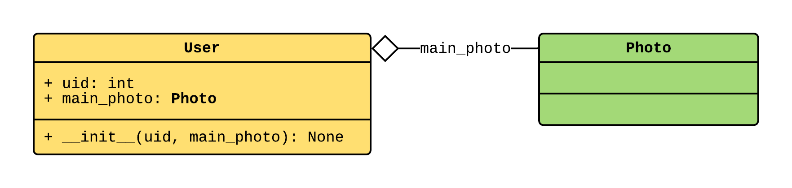
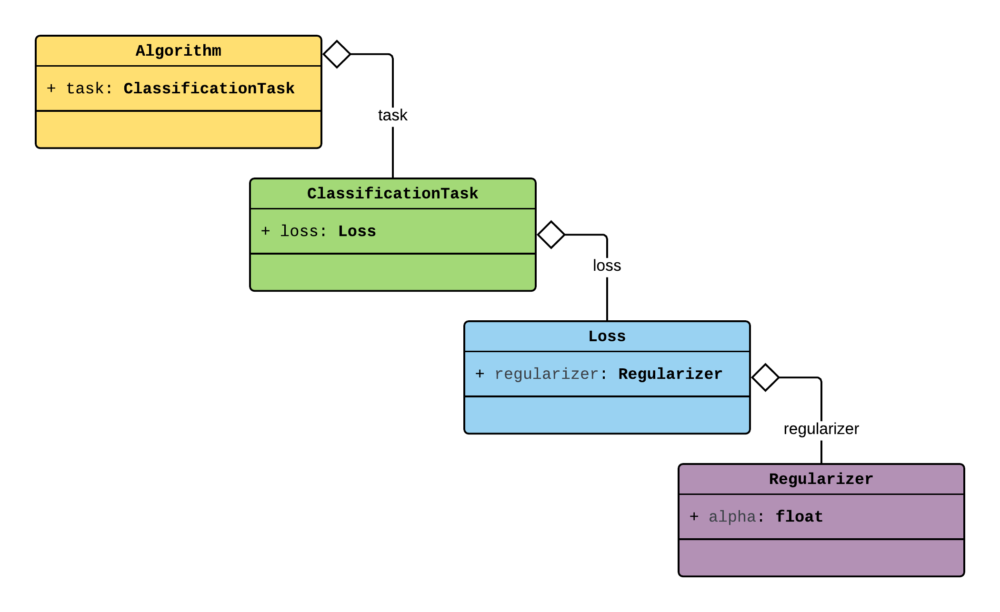
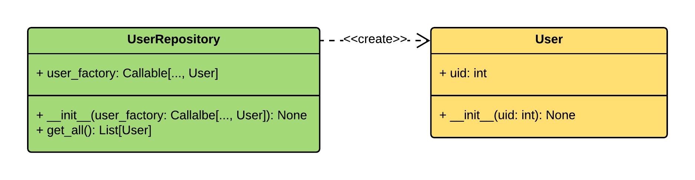
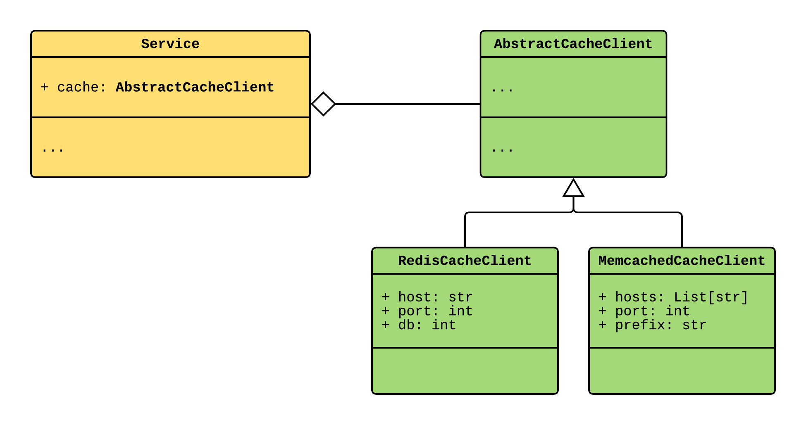
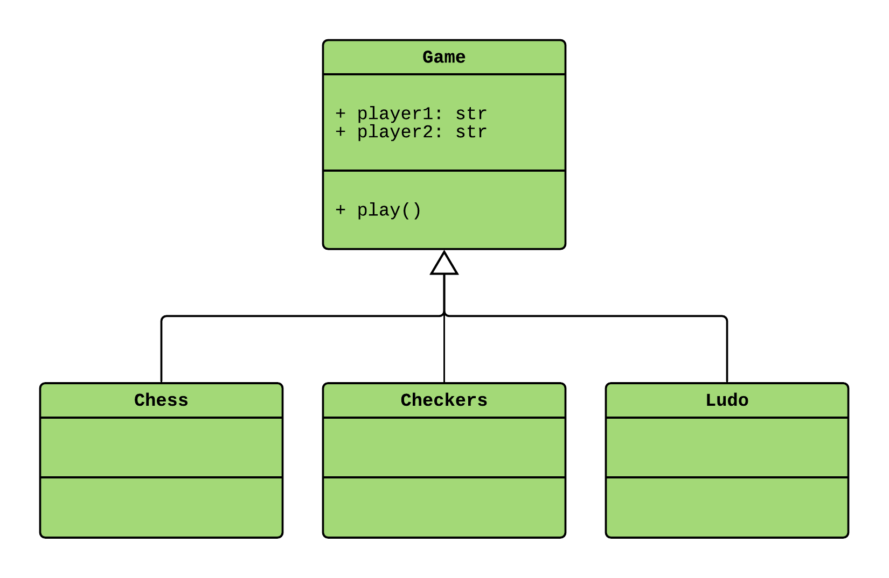

원문 : [https://python-dependency-injector.ets-labs.org/providers/factory.html](https://python-dependency-injector.ets-labs.org/providers/factory.html)

[`Factory`](https://python-dependency-injector.ets-labs.org/api/providers.html#dependency_injector.providers.Factory) Provider는 새로운 객체들을 생성합니다.

```python
from dependency_injector import containers, providers


class User:
    ...


class Container(containers.DeclarativeContainer):

    user_factory = providers.Factory(User)


if __name__ == "__main__":
    container = Container()

    user1 = container.user_factory()
    user2 = container.user_factory()
```

`Factory` Provider의 첫번째 인자는 객체를 생성할 클래스, 팩토리 함수 또는 메소드입니다.

나머지 `Factory`의 위치적, 키워드 인자는 의존성들입니다.
`Factory`는 의존성을 새로운 객체가 생성될 때마다 주입합니다.
의존성들은 아래의 규칙에 따라 주입됩니다.

* 의존성이 Provider이면 호출되고 그 결과가 주입됩니다.
* Provider 자체의 주입이 필요한 경우 `.provider` 속성을 사용합니다. 자세한 것은 [객체에 Provider 전달하기](#passing-providers-to-the-objects)를 참고하세요.
* 다른 모든 종속성들은 "그대로" 주입됩니다.
* 위치적 컨텍스트 인자는 `Factory` 위치적 의존성 뒤에 추가됩니다.
* 키워드 컨텍스트 인자는 같은 이름일 경우 `Factory` 키워드 의존성보다 우선됩니다.



```python
from dependency_injector import containers, providers


class Photo:
    ...


class User:
    def __init__(self, uid: int, main_photo: Photo) -> None:
        self.uid = uid
        self.main_photo = main_photo


class Container(containers.DeclarativeContainer):

    photo_factory = providers.Factory(Photo)

    user_factory = providers.Factory(
        User,
        main_photo=photo_factory,
    )


if __name__ == "__main__":
    container = Container()

    user1 = container.user_factory(1)
    # user1 = User(1, main_photo=Photo()) 와 같습니다.

    user2 = container.user_factory(2)
    # user2 = User(2, main_photo=Photo()) 와 같습니다.

    another_photo = Photo()
    user3 = container.user_factory(
        uid=3,
        main_photo=another_photo,
    )
    # user3 = User(uid=3, main_photo=another_photo) 와 같습니다.
```

`Facotry` Provider는 속성을 주입할 수 있습니다.
속성 주입을 명시하기 위해 `.add_attributes()` 메소드를 사용합니다.

```python {18}
from dependency_injector import containers, providers


class Client:
    ...


class Service:
    def __init__(self) -> None:
        self.client = None


class Container(containers.DeclarativeContainer):

    client = providers.Factory(Client)

    service = providers.Factory(Service)
    service.add_attributes(client=client)


if __name__ == "__main__":
    container = Container()

    service = container.service()

    assert isinstance(service.client, Client)
```

## 내부 Provider에 인자 전달하기 {#passing-arguments-to-the-underlying-providers}

`Factory` Provider는 내부 Provider에 인자를 전달할 수 있습니다.
이것은 중첩된 객체 그래프를 조립하고 내부 안쪽까지 인자를 전달하는데 도움을 줍니다.

이 예제를 고려해보겠습니다.



`Algorithm`을 생성하려면 `ClassificationTask`, `Loss`, `Regularizer` 모든 의존성을 제공해야합니다.
체인의 마지막 객체, `Regularizer`는 `alpha`값을 의존성으로 가지고 있습니다.
`alpha`값은 알고리즘마다 상이합니다.

```python
Algorithm(
    task=ClassificationTask(
        loss=Loss(
            regularizer=Regularizer(
                alpha=alpha,  # <-- 의존성
            ),
        ),
    ),
)
```

`Factory` Provider는 이러한 구성을 다루는데 도움을 줍니다.
모든 클래스에 대한 팩토리를 생성하고 `alpha` 인자를 전달하기 위해 특수 이중 언더바 `__` 문법을 사용해야합니다.

```python {44,49}
from dependency_injector import containers, providers


class Regularizer:
    def __init__(self, alpha: float) -> None:
        self.alpha = alpha


class Loss:
    def __init__(self, regularizer: Regularizer) -> None:
        self.regularizer = regularizer


class ClassificationTask:
    def __init__(self, loss: Loss) -> None:
        self.loss = loss


class Algorithm:
    def __init__(self, task: ClassificationTask) -> None:
        self.task = task


class Container(containers.DeclarativeContainer):

    algorithm_factory = providers.Factory(
        Algorithm,
        task=providers.Factory(
            ClassificationTask,
            loss=providers.Factory(
                Loss,
                regularizer=providers.Factory(
                    Regularizer,
                ),
            ),
        ),
    )


if __name__ == "__main__":
    container = Container()

    algorithm_1 = container.algorithm_factory(
        task__loss__regularizer__alpha=0.5,
    )
    assert algorithm_1.task.loss.regularizer.alpha == 0.5

    algorithm_2 = container.algorithm_factory(
        task__loss__regularizer__alpha=0.7,
    )
    assert algorithm_2.task.loss.regularizer.alpha == 0.7
```

키워드 인자의 이름에 `__`구분자를 사용하면 `Factory`가 `__` 표현식의 우측에 동일한 이름의 의존성을 찾습니다.

```
<dependency>__<keyword for the underlying provider>=<value>
```

만약 `<dependency>`가 내부 Provider에 있다면 `<keyword for the underlying provider>=<value>`를 인자로 받습니다.

## 객체에 Provider 전달하기 {#passing-providers-to-the-objects}

Provider의 호출결과가 아닌 자체를 주입해야한다면 Provider의 `.provider` 속성을 사용합니다.



```python {28}
from typing import Callable, List

from dependency_injector import containers, providers


class User:
    def __init__(self, uid: int) -> None:
        self.uid = uid


class UserRepository:
    def __init__(self, user_factory: Callable[..., User]) -> None:
        self.user_factory = user_factory

    def get_all(self) -> List[User]:
        return [
            self.user_factory(**user_data)
            for user_data in [{"uid": 1}, {"uid": 2}]
        ]


class Container(containers.DeclarativeContainer):

    user_factory = providers.Factory(User)

    user_repository_factory = providers.Factory(
        UserRepository,
        user_factory=user_factory.provider,
    )


if __name__ == "__main__":
    container = Container()

    user_repository = container.user_repository_factory()

    user1, user2 = user_repository.get_all()

    assert user1.uid == 1
    assert user2.uid == 2
```

:::note
모든 Provider가 `.provider`속성을 가지고 있습니다.
:::

## 문자열로 가져오기 {#string-imports}

`Factory` Provider는 문자열 가져오기를 처리할 수 있습니다.

```python
class Container(containers.DeclarativeContainer):

    service = providers.Factory("myapp.mypackage.mymodule.Service")
```

상대적 가져오기로 만들 수 도 있습니다.

```python
# myapp/container.py 에서

class Container(containers.DeclarativeContainer):

    service = providers.Factory(".mypackage.mymodule.Service")
```

또는 현재 모듈의 멤버를 이름으로 지정하여 가져옵니다.

```python
class Service:
    ...


class Container(containers.DeclarativeContainer):

    service = providers.Factory("Service")
```

:::note
`Singleton`, `Callable`, `Resource`, `Coroutine` Provider들은 `Factory` Provider와 동일한 방법으로 문자열로 가져오기가 가능합니다.
:::

## 제공되는 유형 지정하기 {#specializing-the-provided-type}

특정 유형만 제공되는 특별화된 `Factory` Provider를 만들 수 있습니다.
이것을 위해 `Factory` Provider의 하위 클래스를 생성하고, `provided_type` 클래스 속성을 정의해야합니다.

```python {12-14}
from dependency_injector import containers, providers, errors


class BaseService:
    ...


class SomeService(BaseService):
    ...


class ServiceProvider(providers.Factory):

    provided_type = BaseService


# 알맞은 유형으로 서비스 Provider 생성하기:
class Services(containers.DeclarativeContainer):

    some_service_provider = ServiceProvider(SomeService)


# 잘못된 유형으로 서비스 Provider 생성시도하기
try:
    class Container(containers.DeclarativeContainer):
        some_service_provider = ServiceProvider(object)
except errors.Error as exception:
    print(exception)
    # 출력은 아래와 같습니다:
    # <class "__main__.ServiceProvider"> can provide only
    # <class "__main__.BaseService"> instances
```

## 추상적 Factory {#abstract-factory}

[`AbstractFactory`](https://python-dependency-injector.ets-labs.org/api/providers.html#dependency_injector.providers.AbstractFactory) Provider는 기반이 되는 Provider 클래스를 만들고 특정 구현에 대해 아직 미정일 경우 도움이 됩니다.
`AbstractFactory` Provider는 2개의 특이점을 가진 `Factory` Provider 입니다.

* 지정된 유형의 객체만 제공
* 사용전 재정의가 반드시 필요



```python {34}
import abc
import dataclasses
import random
from typing import List

from dependency_injector import containers, providers


class AbstractCacheClient(metaclass=abc.ABCMeta):
    ...


@dataclasses.dataclass
class RedisCacheClient(AbstractCacheClient):
    host: str
    port: int
    db: int


@dataclasses.dataclass
class MemcachedCacheClient(AbstractCacheClient):
    hosts: List[str]
    port: int
    prefix: str


@dataclasses.dataclass
class Service:
    cache: AbstractCacheClient


class Container(containers.DeclarativeContainer):

    cache_client_factory = providers.AbstractFactory(AbstractCacheClient)

    service_factory = providers.Factory(
        Service,
        cache=cache_client_factory,
    )


if __name__ == "__main__":
    container = Container()

    cache_type = random.choice(["redis", "memcached"])
    if cache_type == "redis":
        container.cache_client_factory.override(
            providers.Factory(
                RedisCacheClient,
                host="localhost",
                port=6379,
                db=0,
            ),
        )
    elif cache_type == "memcached":
        container.cache_client_factory.override(
            providers.Factory(
                MemcachedCacheClient,
                hosts=["10.0.1.1"],
                port=11211,
                prefix="my_app",
            ),
        )

    service = container.service_factory()
    print(service.cache)
    # cache_type 변수값에 따라 결과가 다릅니다.
    #
    # 값이 "redis" 이면:
    # RedisCacheClient(host="localhost", port=6379, db=0)
    #
    # 값이 "memcached" 이면:
    # MemcachedCacheClient(hosts=["10.0.1.1"], port=11211, prefix="my_app")
    #
    # 값이 None 이면:
    # Error: AbstractFactory(<class "__main__.AbstractCacheClient">) must be
    # overridden before calling
```

## Factory 집합 {#factory-aggregate}

[`FactoryAggregate`](https://python-dependency-injector.ets-labs.org/api/providers.html#dependency_injector.providers.FactoryAggregate) Provider는 다수의 Factory를 집합으로 제공합니다.

:::note 함께보기
[`Aggregate Provider`](https://python-dependency-injector.ets-labs.org/providers/aggregate.html#aggregate-provider) - `FactoryAggregate` Provider의 후속으로 `Factory` 뿐만아니라 다른 유형의 Provider를 집합시킬 수 있습니다.
:::

집합된 Factory들은 문자열 키로 연결됩니다.
`FactoryAggregate`를 호출할 때 첫번째 인자로 이 키들중 하나를 제공해야 합니다.
`FactoryAggregate`는 키가 일치하는 Factory를 탐색하고 나머지 인자를 가지고 그것을 호출합니다.



```python {33-37}
import dataclasses
import sys

from dependency_injector import containers, providers


@dataclasses.dataclass
class Game:
    player1: str
    player2: str

    def play(self):
        print(
            f"{self.player1} and {self.player2} are "
            f"playing {self.__class__.__name__.lower()}"
        )


class Chess(Game):
    ...


class Checkers(Game):
    ...


class Ludo(Game):
    ...


class Container(containers.DeclarativeContainer):

    game_factory = providers.FactoryAggregate(
        chess=providers.Factory(Chess),
        checkers=providers.Factory(Checkers),
        ludo=providers.Factory(Ludo),
    )


if __name__ == "__main__":
    game_type = sys.argv[1].lower()
    player1 = sys.argv[2].capitalize()
    player2 = sys.argv[3].capitalize()

    container = Container()

    selected_game = container.game_factory(game_type, player1, player2)
    selected_game.play()

    # $ python factory_aggregate.py chess John Jane
    # John and Jane are playing chess
    #
    # $ python factory_aggregate.py checkers John Jane
    # John and Jane are playing checkers
    #
    # $ python factory_aggregate.py ludo John Jane
    # John and Jane are playing ludo
```

`.providers` 속성을 사용하면 집합된 Provider들의 딕셔너리를 가져올 수 있습니다.
이전 예제에서 게임 Provider의 딕셔너리를 가져오려면 `game_factory.providers` 속성을 사용하면 됩니다.

또한 속성처럼 집합된 Provider에 접근할 수 있습니다.
이전 예제에서 `Chess` 객체를 생성하는 것은 `chess = game_factory.chess("John", "Jane")`로 할 수 있습니다.

:::warning
`FactoryAggregate` Provider를 재정의할 수 없습니다.
:::

:::note
`FactoryAggregate` Provider를 주입할 때는 "있는 그대로" 전달됩니다.
:::

문자열이 아니거나, `.`과 `-`를 사용한 문자열 키를 사용하려면 위치적 인자를 딕셔너리에 제공해야합니다.

```python
providers.FactoryAggregate({
    SomeClass: providers.Factory(...),
    "key.with.periods": providers.Factory(...),
    "key-with-dashes": providers.Factory(...),
})
```

예로 들면,

```python {30-33}
from dependency_injector import containers, providers


class Command:
    ...


class CommandA(Command):
    ...


class CommandB(Command):
    ...


class Handler:
    ...


class HandlerA(Handler):
    ...


class HandlerB(Handler):
    ...


class Container(containers.DeclarativeContainer):

    handler_factory = providers.FactoryAggregate({
        CommandA: providers.Factory(HandlerA),
        CommandB: providers.Factory(HandlerB),
    })


if __name__ == "__main__":
    container = Container()

    handler_a = container.handler_factory(CommandA)
    handler_b = container.handler_factory(CommandB)

    assert isinstance(handler_a, HandlerA)
    assert isinstance(handler_b, HandlerB)
```

<AdsenseB/>