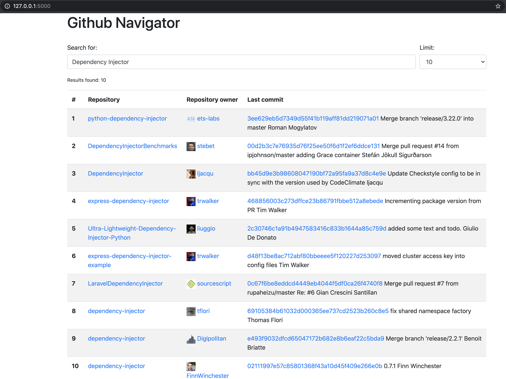
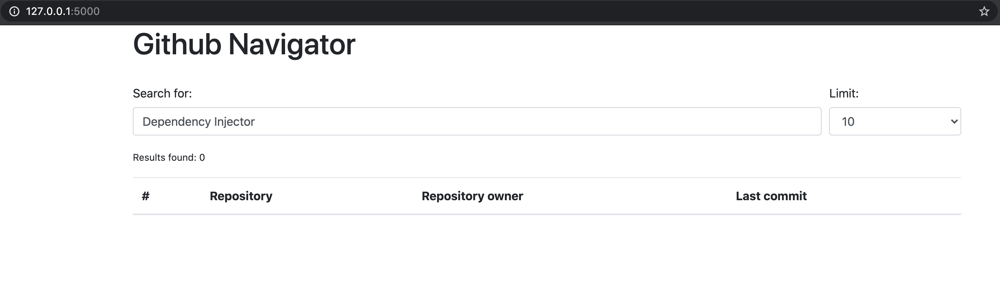

원문: [https://python-dependency-injector.ets-labs.org/tutorials/flask.html](https://python-dependency-injector.ets-labs.org/tutorials/flask.html)

이 튜토리얼은 의존성 주입 원리에 따라 `Flask` 어플리케이션을 어떻게 만드는지 보여줍니다.

처음부터 시작하거나 원하는 절로 이동해보세요.

* [무엇을 만들게 될까요?](#what-are-we-going-to-build)
* [환경 준비하기](#prepare-the-environment)
* [프로젝트 구성](#project-layout)
* [Hello World!](#hello-world)
* [예쁘게 만들어보기](#make-it-pretty)
* [깃허브에 접속하기](#connect-to-the-github)
* [검색 서비스](#search-service)
* [검색 서비스를 뷰에 주입하기](#inject-search-service-into-view)
* [조금 리펙터링하기](#make-some-refactoring)
* [테스트](#tests)
* [결론](#conclusion)

전체 프로젝트 내용은 [깃허브](https://github.com/ets-labs/python-dependency-injector/tree/master/examples/miniapps/flask)에서 보실 수 있습니다.

## 무엇을 만들게 될까요? {#what-are-we-going-to-build}

깃허브의 레포지토리를 검색할 수 있는 웹 어플리케이션을 만들 것 입니다.
이것을 깃허브 네비게이터라고 부르겠습니다.

깃허브 네비게이터가 무엇을 할 수 있을까요?

* 사용자가 검색 쿼리를 제공할 수 있는 웹 페이지를 엽니다.
* 사용자가 쿼리를 입력하고 엔터를 입력합니다.
* 깃허브 네비게이터가 이것을 받아 깃허브에 일치하는 레포지토리를 검색합니다.
* 검색이 완료되면 깃허브 네비게이터는 사용자에게 결과를 웹페이지로 반환합니다.
* 결과 페이지는 일치하는 모든 레포지토리와 제공된 검색쿼리를 보여줍니다.
* 일치하는 레포지토리에 대하여 사용자는 다음을 볼 수 있습니다.
  * 레포지토리 이름
  * 레포지토리의 소유자
  * 레포지토리의 마지막 커밋
* 사용자는 깃허브에 해당 웹페이지를 열기위해 레포지토리, 소유자, 마지막 커밋을 클릭할 수 있습니다.



## 환경 준비하기 {#prepare-the-environment}

프로젝트를 위해 환경을 생성하겠습니다.

첫번째로 프로젝트 폴더를 구성합니다.

```shell
mkdir ghnav-flask-tutorial
cd ghnav-flask-tutorial
```

이제 가상환경을 만들고 활성화 하겠습니다.

```shell
python3 -m venv venv
. venv/bin/activate
```

## 프로젝트 구성 {#project-layout}

환경이 준비되면 이제 프로젝트 구성을 할 차례입니다.

현재 디렉터리에 다음 구성을 생성합니다.
모든 파일은 비어있지만 상관없습니다.

초기 프로젝트 구성:

```
./
├── githubnavigator/
│   ├── __init__.py
│   ├── application.py
│   ├── containers.py
│   └── views.py
├── venv/
└── requirements.txt
```

이제 `Flask`와 `Dependency Injector`를 설치하겠습니다.

다음 내용을 `requirements.txt` 파일에 입력합니다.

```
dependency-injector
flask
```

이제 설치하겠습니다.

```shell
pip install -r requirements.txt
```

설치가 잘 되었는지 확인해봅니다.

```shell
python -c "import dependency_injector; print(dependency_injector.__version__)"
python -c "import flask; print(flask.__version__)"
```

아마 다음과 같을 것 입니다.

```shell
(venv) $ python -c "import dependency_injector; print(dependency_injector.__version__)"
4.37.0
(venv) $ python -c "import flask; print(flask.__version__)"
2.0.2
```

버전은 다를 수 있지만 괜찮습니다.

## Hello World! {#hello-world}

최소한의 어플리케이션을 만들겠습니다.

다음을 `views.py`에 입력합니다.

```python
"""Views module."""

def index():
    return "Hello, World!"
```

이제 뷰를 가지게 되었습니다.

컨테이너를 만들겠습니다.
컨테이너는 어플리케이션의 모든 컴포넌트와 그 의존성을 가지고 있습니다.

`containers.py`를 수정합니다.

```python
"""Containers module."""

from dependency_injector import containers

class Container(containers.DeclarativeContainer):
    ...
```

컨테이너는 현재 비어있습니다.
이어지는 절에서 Provider를 추가할 것입니다.

마지막으로 Flask 어플리케이션 팩토리를 생성해야 합니다.
컨테이너와 Flask 어플리케이션을 생성하고 구성하게 됩니다.
일반적으로 `create_app()`을 호출합니다.
웹 어플리케이션에서 상위(`/`)의 호출을 다루는 `index` 뷰를 할당하겠습니다.

다음을 `application.py`에 입력합니다.

```python
"""Application module."""

from flask import Flask

from .containers import Container
from . import views

def create_app() -> Flask:
    container = Container()

    app = Flask(__name__)
    app.container = container
    app.add_url_rule("/", "index", views.index)

    return app
```

되었습니다.
이제 "Hello, World!"를 이야기할 준비가 되었습니다.

다음을 터미널에서 실행합니다.

```shell
export FLASK_APP=githubnavigator.application
export FLASK_ENV=development
flask run
```

출력이 다음과 같을 것 입니다.

```
* Serving Flask app "githubnavigator.application" (lazy loading)
* Environment: development
* Debug mode: on
* Running on http://127.0.0.1:5000/ (Press CTRL+C to quit)
* Restarting with fsevents reloader
* Debugger is active!
* Debugger PIN: 473-587-859
```

브라우저를 열고 `http://127.0.0.1:5000/`에 접속합니다.

`Hello, World!`를 볼 수 있습니다.

끝입니다.
우리의 최소 어플리케이션이 기동되고 동작하고 있습니다.

## 예쁘게 만들어보기 {#make-it-pretty}

이제 조금더 이쁘게 만들어보겠습니다.
[Bootstrap 4](https://getbootstrap.com/)를 사용하겠습니다.
어플리케이션에 이것을 추가하기 위해 [Bootstrap-Flask](https://pypi.org/project/Bootstrap-Flask/) 확장을 추가하겠습니다.
몇번의 클릭으로 필요한 정적 파일을 추가할 수 있게 도와줍니다.

`requirements.txt`파일에 `bootstrap-flask`를 추가합니다.

```
dependency_injector
flask
bootstrap-flask
```

그리고 터미널에서 실행합니다.

```shell
pip install -r requirements.txt
```

이제 `bootstrap-flask` 확장을 초기화하겠습니다.
`create_app()`을 수정해야합니다.

`application.py`를 수정합니다.

```python {4,16-17}
"""Application module."""

from flask import Flask
from flask_bootstrap import Bootstrap

from .containers import Container
from . import views

def create_app() -> Flask:
    container = Container()

    app = Flask(__name__)
    app.container = container
    app.add_url_rule("/", "index", views.index)

    bootstrap = Bootstrap()
    bootstrap.init_app(app)

    return app
```

이제 템플릿을 추가합니다.
이것을 위해 `githubnavigator` 패키지에 `templates/` 폴더를 생성하고 다음 두 파일을 추가합니다.

* `base.html` - 구성
* `index.html` - 메인 페이지

`templates` 폴더를 생성하고 `base.html`, `index.html` 두 비어있는 파일을 추가합니다.

``` {3-5}
./
├── githubnavigator/
│   ├── templates/
│   │   ├── base.html
│   │   └── index.html
│   ├── __init__.py
│   ├── application.py
│   ├── containers.py
│   └── views.py
├── venv/
└── requirements.txt
```

이제 구성을 채우겠습니다.

`base.html`에 다음을 입력합니다.

```django
<!doctype html>
<html lang="en">
    <head>
        
        <!-- Required meta tags -->
        <meta charset="utf-8">
        <meta name="viewport" content="width=device-width, initial-scale=1, shrink-to-fit=no">

        
            <!-- Bootstrap CSS -->
            {{ bootstrap.load_css() }}
        

        <title></title>
        
    </head>
    <body>
        <!-- Your page content -->
        

        
            <!-- Optional JavaScript -->
            {{ bootstrap.load_js() }}
        
    </body>
</html>
```

그리고, 인덱스 페이지에 무언가를 추가하겠습니다.

`index.html`에 다음을 입력하세요.

```django


Github Navigator


<div class="container">
    <h1 class="mb-4">Github Navigator</h1>

    <form>
        <div class="form-group form-row">
            <div class="col-10">
                <label for="search_query" class="col-form-label">
                    Search for:
                </label>
                <input class="form-control" type="text" id="search_query"
                       placeholder="Type something to search on the GitHub"
                       name="query"
                       value="{{ query if query }}">
            </div>
            <div class="col">
                <label for="search_limit" class="col-form-label">
                    Limit:
                </label>
                <select class="form-control" id="search_limit" name="limit">
                    
                    <option selected>
                        {{ value }}
                    </option>
                    
                </select>
            </div>
        </div>
    </form>

    <p><small>Results found: {{ repositories|length }}</small></p>

    <table class="table table-striped">
        <thead>
            <tr>
                <th>#</th>
                <th>Repository</th>
                <th class="text-nowrap">Repository owner</th>
                <th class="text-nowrap">Last commit</th>
            </tr>
        </thead>
        <tbody>
         {{n}}
            <tr>
              <th>{{ loop.index }}</th>
              <td><a href="{{ repository.url }}">
                  {{ repository.name }}</a>
              </td>
              <td><a href="{{ repository.owner.url }}">
                  </a>
                  <a href="{{ repository.owner.url }}">
                      {{ repository.owner.login }}</a>
              </td>
              <td><a href="{{ repository.latest_commit.url }}">
                  {{ repository.latest_commit.sha }}</a>
                  {{ repository.latest_commit.message }}
                  {{ repository.latest_commit.author_name }}
              </td>
            </tr>
        
        </tbody>
    </table>
</div>


```

거의 다와갑니다.
마지막 단계는 `index.html` 템플릿을 렌더링하기 위해 `index` 뷰를 만들겠습니다.

`views.py`를 편집합니다.

```python
"""Views modules."""

from flask import request, render_template

def index():
    query = request.args.get("query", "Dependency Injector")
    limit = request.args.get("limit", 10, int)

    repositories = []

    return render_template(
        "index.html",
        query=query,
        limit=limit,
        repositories=repositories,
    )
```

끝입니다.

어플리케이션을 실행하거나 `flask run`를 사용합니다.
그리고 `http://127.0.0.1:5000/`에 접속합니다.

아래와 같이 볼 수 있습니다.



## 깃허브에 접속하기 {#connect-to-the-github}

이번 절에서는 어플리케이션에 깃허브 API를 통합해보겠습니다.

깃허브 API와 통신하기 위하여 [PyGithub](https://github.com/PyGithub/PyGithub) 라이브러리를 사용하겠습니다.

`requirements.txt`에 추가하겠습니다.

``` {4}
dependency-injector
flask
bootstrap-flask
pygithub
```

그리고 터미널에서 다음을 실행합니다.

```shell
pip install -r requirements.txt
```

이제 컨테이너에 깃허브 API 클라이언트를 추가합니다.
`dependency_injector.providers` 모듈에서 두개 이상의 Provider를 추가할 수 있습니다.

* `Factory` Provider. `Github` 클라이언트를 생성합니다.
* `Configuration` Provider. `Github` 클라이언트의 API 토큰과 요청 타임아웃을 제공합니다. 구성 파일의 위치를 지정합니다. 구성 Provider는 컨테이너 인스턴스가 생성될 때 구성파일을 파싱합니다.

`containers.py`를 편집합니다.

```python {3-4,9,11-15}
"""Containers module."""

from dependency_injector import containers, providers
from github import Github


class Container(containers.DeclarativeContainer):

    config = providers.Configuration(yaml_files=["config.yml"])

    github_client = providers.Factory(
        Github,
        login_or_token=config.github.auth_token,
        timeout=config.github.request_timeout,
    )
```

:::note
컨테이너에서 마침표(`...`)를 지우는 것을 잊지마세요.
컨테이너가 이제 비어있지 않으므로 필요가 없습니다.
:::

이제 구성파일을 추가하겠습니다.
YAML을 사용할 것 입니다.
프로젝트 최상위에 비어있는 `config.yml` 파일을 생성합니다.

``` {11}
./
├── githubnavigator/
│   ├── templates/
│   │   ├── base.html
│   │   └── index.html
│   ├── __init__.py
│   ├── application.py
│   ├── containers.py
│   └── views.py
├── venv/
├── config.yml
└── requirements.txt
```

그리고 다음 내용을 추가합니다.

```yaml
github:
  request_timeout: 10
```

구성파일을 파싱하기 위해 [PyYAML](https://pypi.org/project/PyYAML/) 라이브러리를 사용할 것 입니다.
requirements 파일에 추가하겠습니다.

`requirements.txt`를 편집합니다.

``` {5}
dependency-injector
flask
bootstrap-flask
pygithub
pyyaml
```

그리고 설치하겠습니다.

```shell
pip install -r requirements.txt
```

API 토큰을 제공하기 위해 `GITHUB_TOKEN` 환경변수를 사용할 것 입니다.
`create_app()`을 편집하여 토큰값을 가져오겠습니다.

`application.py`를 편집합니다.

```python {12}
"""Application module."""

from flask import Flask
from flask_bootstrap import Bootstrap

from .containers import Container
from . import views


def create_app() -> Flask:
    container = Container()
    container.config.github.auth_token.from_env("GITHUB_TOKEN")

    app = Flask(__name__)
    app.container = container
    app.add_url_rule("/", "index", views.index)

    bootstrap = Bootstrap()
    bootstrap.init_app(app)

    return app
```

이제 API 토큰을 만들어야 합니다.

지금은 걱정말고 아래것을 사용하겠습니다.

```shell
export GITHUB_TOKEN=cbde697a6e01424856fde2b7f94a88d1b501320e
```

:::note
자체 토큰을 생성하려면

* [깃허브 가이드](https://docs.github.com/en/github/authenticating-to-github/creating-a-personal-access-token)를 따라하세요.
* 환경변수에 토큰을 설정합니다.
  ```shell
  export GITHUB_TOKEN=<your token>
  ```
:::

다했습니다.

깃허브 API 클라이언트 설정이 완료되었습니다.

## 검색 서비스 {#search-service}

이제 `SearchService`를 추가할 차례입니다.

* 검색을 수행합니다.
* 각 결과에 커밋 추가데이터를 가져옵니다.
* 결과 데이터를 포맷팅합니다.

`SearchService`는 `Github` API 클라이언트를 사용할 것입니다.

`githubnavigator` 패키지에 빈 `services.py`를 생성합니다.

``` {9}
./
├── githubnavigator/
│   ├── templates/
│   │   ├── base.html
│   │   └── index.html
│   ├── __init__.py
│   ├── application.py
│   ├── containers.py
│   ├── services.py
│   └── views.py
├── venv/
├── config.yml
└── requirements.txt
```

그리고 다음을 입력합니다.

```python
"""Services module."""

from github import Github
from github.Repository import Repository
from github.Commit import Commit


class SearchService:
    """Search Service는 깃허브에서 검색을 수행합니다."""

    def __init__(self, github_client: Github):
        self._github_client = github_client

    def search_repositories(self, query, limit):
        """레포지토리를 검색하고 정제된 데이터를 반환합니다."""
        repositores = self._github_client.search_repositories(
            query=query,
            **{"in": "name"},
        )
        return [
            self._format_repo(repository)
            for repository in repositories[:limit]
        ]
    def _format_repo(self, repository: Repository):
        commits = repository.get_commits()
        return {
            "url": repository.html_url,
            "name": repository.name,
            "owner": {
                "login": repository.owner.login,
                "url": repository.owner.html_url,
                "avatar_url": repository.owner.avatar_url,
            },
            "latest_commit": self._format_commit(commits[0]) if commits else {},
        }
    
    def _format_commit(self, commit: Commit):
        return {
            "sha": commit.sha,
            "url": commit.html_url,
            "message": commit.commit.message,
            "author_name": commit.commit.author.name,
        }
```

이제 컨테이너에 `SearchService`를 추가합니다.

`conainers.py`를 편집합니다.

```python {6,19-22}
"""Containers module."""

from dependency_injector import containers, providers
from github import Github

from . import services


class Container(containers.DeclarativeContainer):

    config = providers.Configuration(yaml_files=["config.yml"])

    github_client = providers.Factory(
        Github,
        login_or_token=config.github.auth_token,
        timeout=config.github.request_timeout,
    )

    search_service = providers.Factory(
        services.SearchService,
        github_client=github_client,
    )
```

## 검색 서비스를 뷰에 주입하기 {#inject-search-service-into-view}

이제 검색작업을 만들 준비가 되었습니다.

`index`뷰에 `SearchService`를 주입하겠습니다.
여기서 [연결](https://python-dependency-injector.ets-labs.org/wiring.html#wiring)기능을 사용하겠습니다.

`views.py`를 편집합니다.

```python {4,6-7,10-11,15}
"""Views module."""

from flask import request, render_template
from dependency_injector.wiring import inject, Provide

from .services import SearchService
from .containers import Container


@inject
def index(search_service: SearchService = Provide[Container.search_service]):
    query = request.args.get("query", "Dependency Injector")
    limit = request.args.get("limit", 10, int)

    repositories = search_service.search_repositories(query, limit)

    return render_template(
        "index.html",
        query=query,
        limit=limit,
        repositories=repositories,
    )
```

주입작업이 동작하기 위해 컨테이너에 `view` 모듈을 연결해야합니다.
컨테이너 인스턴스가 생성될 때 자동으로 `views` 모듈에 연결할 수 있도록 컨테이너를 구성하겠습니다.

`containers.py`를 편집합니다.

```python {11}
"""Containers module."""

from dependency_injector import containers, providers
from github import Github

from . import services


class Container(containers.DeclarativeContainer):

    wiring_config = containers.WiringConfiguration(modules=[".views"])

    config = providers.Configuration(yaml_files=["config.yml"])

    github_client = providers.Factory(
        Github,
        login_or_token=config.github.auth_token,
        timeout=config.github.request_timeout,
    )

    search_service = providers.Factory(
        services.SearchService,
        github_client=github_client,
    )
```

앱을 실행하거나 `flask run`을 사용합니다.
그리고 `http://127.0.0.1:5000/`을 탐색합니다.

그럼 아래와 같이 볼 수 있습니다.


## 조금 리펙터링하기 {#make-some-refactoring}

`index` 뷰는 두개의 하드코드로 된 구성값을 가지고 있습니다.

* 기본 검색 쿼리
* 기본 검색 제한

약간의 리펙터링을 하겠습니다.
이 값을 구성으로 이동해보겠습니다.

`views.py`를 편집합니다.

```python {11-17}
"""Views module."""

from flask import request, render_template
from dependency_injector.wiring import inject, Provide

from .services import SearchService
from .containers import Container


@inject
def index(
        search_service: SearchService = Provide[Container.search_service],
        default_query: str = Provide[Container.config.default.query],
        default_limit: int = Provide[Container.config.default.limit.as_int()],
):
    query = request.args.get("query", default_query)
    limit = request.args.get("limit", default_limit, int)

    repositories = search_service.search_repositories(query, limit)

    return render_template(
        "index.html",
        query=query,
        limit=limit,
        repositories=repositories,
    )
```

`config.yml`를 편집합니다.

```yaml {3-5}
github:
  request_timeout: 10
default:
  query: "Dependency Injector"
  limit: 10
```

## 테스트 {#tests}

이번 절에서는 몇개의 테스트를 추가해보겠습니다.

[pytest](https://docs.pytest.org/en/stable/)와 Flask 확장, [coverage](https://coverage.readthedocs.io/)를 사용하겠습니다.

`requirements.txt`를 편집합니다.

``` {6-7}
dependency-injector
flask
bootstrap-flask
pygithub
pyyaml
pytest-flask
pytest-cov
```

그리고 추가된 패키지를 설치합니다.

```shell
pip install -r requirements.txt
```

`githubnavigator` 패키지에 빈 `tests.py`를 생성합니다.

``` {10}
./
├── githubnavigator/
│   ├── templates/
│   │   ├── base.html
│   │   └── index.html
│   ├── __init__.py
│   ├── application.py
│   ├── containers.py
│   ├── services.py
│   ├── tests.py
│   └── views.py
├── venv/
├── config.yml
└── requirements.txt
```

그리고 다음내용을 추가합니다.

```python {44,67}
"""Tests module."""

from unittest import mock

import pytest
from github import Github
from flask import url_for

from .application import create_app


@pytest.fixture
def app():
    app = create_app()
    yield app
    app.container.unwire()


def test_index(client, app):
    github_client_mock = mock.Mock(spec=Github)
    github_client_mock.search_repositories.return_value = [
        mock.Mock(
            html_url="repo1-url",
            name="repo1-name",
            owner=mock.Mock(
                login="owner1-login",
                html_url="owner1-url",
                avatar_url="owner1-avatar-url",
            ),
            get_commits=mock.Mock(return_value=[mock.Mock()]),
        ),
        mock.Mock(
            html_url="repo2-url",
            name="repo2-name",
            owner=mock.Mock(
                login="owner2-login",
                html_url="owner2-url",
                avatar_url="owner2-avatar-url",
            ),
            get_commits=mock.Mock(return_value=[mock.Mock()]),
        ),
    ]

    with app.container.github_client.override(github_client_mock):
        response = client.get(url_for("index"))

    assert response.status_code == 200
    assert b"Results found: 2" in response.data

    assert b"repo1-url" in response.data
    assert b"repo1-name" in response.data
    assert b"owner1-login" in response.data
    assert b"owner1-url" in response.data
    assert b"owner1-avatar-url" in response.data

    assert b"repo2-url" in response.data
    assert b"repo2-name" in response.data
    assert b"owner2-login" in response.data
    assert b"owner2-url" in response.data
    assert b"owner2-avatar-url" in response.data


def test_index_no_results(client, app):
    github_client_mock = mock.Mock(spec=Github)
    github_client_mock.search_repositories.return_value = []

    with app.container.github_client.override(github_client_mock):
        response = client.get(url_for("index"))

    assert response.status_code == 200
    assert b"Results found: 0" in response.data
```

이제 이것을 실행하고 커버리지를 확인합니다.

```shell
py.test githubnavigator/tests.py --cov=githubnavigator
```

아래와 같이 볼 수 있습니다.

```
platform darwin -- Python 3.10.0, pytest-6.2.5, py-1.10.0, pluggy-1.0.0
plugins: cov-3.0.0, flask-1.2.0
collected 2 items

githubnavigator/tests.py ..                                     [100%]

---------- coverage: platform darwin, python 3.10.0-final-0 ----------
Name                             Stmts   Miss  Cover
----------------------------------------------------
githubnavigator/__init__.py          0      0   100%
githubnavigator/application.py      13      0   100%
githubnavigator/containers.py        8      0   100%
githubnavigator/services.py         14      0   100%
githubnavigator/tests.py            34      0   100%
githubnavigator/views.py            10      0   100%
----------------------------------------------------
TOTAL                               79      0   100%
```

:::note
`tests.py`에서 강조된 부분을 잘 보세요.

`Github` API 클라이언트를 재정의함을 강조합니다.
:::

## 결론 {#conclusion}

이번 튜토리얼에서 의존성 주입 이론에 따라 `Flask` 어플리케이션을 만들었습니다.
`Dependency Injector`를 의존성 주입 프레임워크로 사용하였습니다.

[컨테이너](https://python-dependency-injector.ets-labs.org/containers/index.html#containers)와 [Provider](../providers/)는 검색 서비스를 만들고 3자 라이브러리와 통합하는 방법을 지정하는데 도움을 줍니다.

[구성 Provider](https://python-dependency-injector.ets-labs.org/providers/configuration.html#configuration-provider)는 YAML 파일과 환경변수를 읽고 다루는데 도움을 줍니다.

`index()` 뷰에 의존성을 주입하기 위해 [연결](https://python-dependency-injector.ets-labs.org/wiring.html#wiring)기능을 사용하였습니다.
[Provider 재정의](https://python-dependency-injector.ets-labs.org/providers/overriding.html#provider-overriding)기능은 테스트를 하는데 도움이 됩니다.

명시적으로 주입된 모든 의존성을 유지했습니다.
이것은 나중에 무언가를 추가하거나 변경하는데 도움이 될 것입니다.

전체 프로젝트 내용은 [깃허브](https://github.com/ets-labs/python-dependency-injector/tree/master/examples/miniapps/flask)에서 보실 수 있습니다.

<AdsenseB />